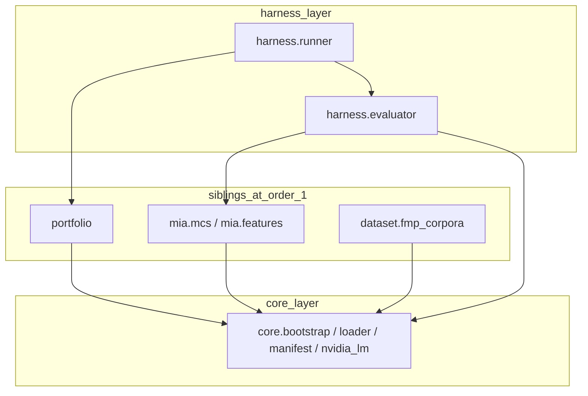
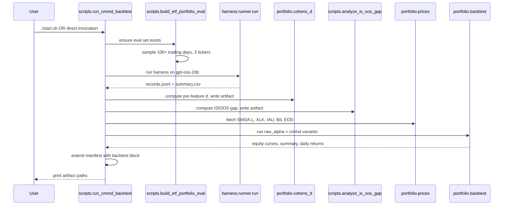
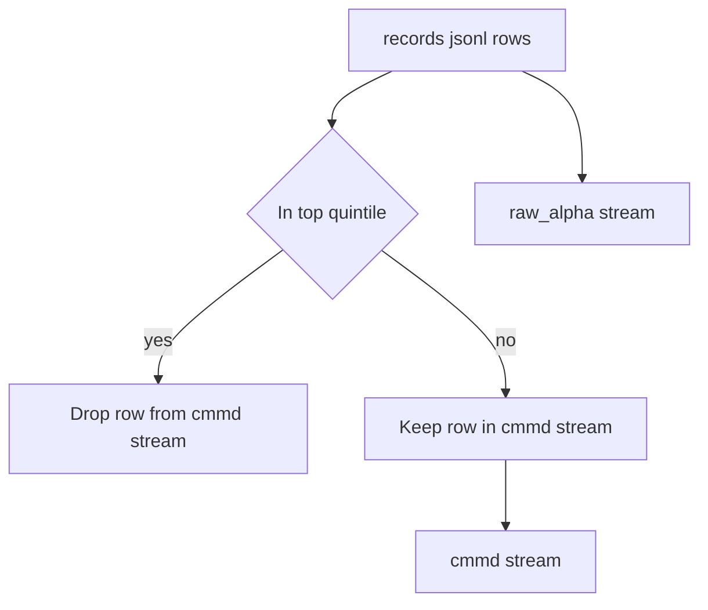

# cmmd-backtest — Design

## Overview

This spec adds a portfolio backtest layer to the harness so the per-model
accuracy numbers get carried through to a Sharpe ratio that you can
actually trade against. The universe is `SWDA.L`, `XLK`, `IAU` with `BIL`
as cash. The pipeline runs the same signal stream twice: once raw, once
with the top-quintile MCS rows filtered out. That second run is what the
paper calls CMMD.

A quant researcher running the backtest entry point gets, on top of the
usual `summary.csv`, a raw-vs-CMMD Sharpe table, equity curves, a daily
returns CSV, and two paper-parity artifacts (per-feature Cohen's d for
Table 3, IS-vs-OOS gap for Figure 5).

The layer is additive. One new sibling under `src/portfolio/`, a tiny
manifest extension in `src/harness/runner.py`, two new dependencies in
`pyproject.toml`. Existing tests are untouched and new tests cover only
the new layer.

### Goals

- Per-(model, MIA-feature) Cohen's d artifact written to every run dir.
- IS-vs-OOS gap surfaced in README sample-run section.
- Long-short cross-sectional backtest over 3 risk assets + BIL cash leg.
- Side-by-side `raw_alpha` vs `cmmd` Sharpe / mean-return / drawdown.
- All output artifacts written to the run dir, manifest extended.

### Non-Goals

- Multi-model ensembles. Single model only (`openai/gpt-oss-20b`).
- Intraday rebalance, futures or options overlays, tax accounting,
  live broker integration.
- Per-ticker MCS (one MCS per model is sufficient).
- New parsing or scoring logic. The backtest reuses the harness path
  verbatim.

## Boundary Commitments

### This Spec Owns

- `src/portfolio/` layer: per-feature Cohen's d, FMP price fetch for
  the universe, vectorbt-backed long-short backtest engine, CMMD
  filter.
- The eval-set builder for the new universe
  (`scripts/build_etf_portfolio_eval.py`) and the orchestrator script
  (`scripts/run_cmmd_backtest.py`).
- Output artifacts: `cohens_d.{csv,md}`, `is_oos_gap.{csv,md}` (already
  generated by an existing script — this spec integrates it),
  `backtest_summary.{csv,md}`, `equity_curves.{csv,png}`,
  `daily_returns.csv`, plus the `backtest` block in `manifest.json`.
- README updates: add Sample-run subsections for IS/OOS gap and
  backtest results.

### Out of Boundary

- Signal generation (LLM call, parser, MIA features, MCS calibration)
  — owned by the `honest-model-ranking` spec, used here unmodified.
- Cutoff registry (`data/cutoffs.yaml`) — read-only here.
- Calibration corpora (`data/calibration/*.jsonl`) — read-only here.
- The existing harness CLI (`harness.py`) — gains no new flags. The
  backtest is its own entry point so a normal `./start.sh` run is
  unaffected.

### Allowed Dependencies

- `src/core/` — `bootstrap_ci`, `manifest`, `loader`, `nvidia_lm`.
- `src/mia/` — `MCSCalibrator` type for type hints; the calibrator
  instance is constructed by the harness, not by this layer.
- `src/dataset/` — only the `EvalRow` / `EvalSet` types from
  `core.loader` (no FMP article corpus dependency).
- `src/harness/evaluator` — `evaluate_model`, `Record`,
  `ModelEvalResult` types.
- External: `vectorbt` (pinned `0.28.*`), `matplotlib`, `pandas`,
  `numpy`, `requests` (already a project dep).

### Revalidation Triggers

| Trigger | Affected | Action |
|---------|----------|--------|
| `evaluate_model` signature change | This spec consumes its return | Re-check the signal-generation flow |
| `Record` schema change | Cohen's d + backtest both read records | Re-validate per-feature names + p_memorized field |
| `MCSCalibrator.predict_proba` change | p_memorized values shift | Re-run, compare CMMD percentile cuts |
| Cutoffs registry edits for gpt-oss-20b | IS/OOS gap labels change | Re-run gap analysis, expect new numbers |

## Architecture

### Existing Architecture Analysis

The harness is layered (`harness → {dataset, mia} → core`) and the
boundaries are sentrux-enforced. The new layer slots in as a third
sibling next to `dataset/` and `mia/`. It depends on `core/`, gets
imported by `harness/`, and has explicit cross-sibling boundaries to
the other two so signal generation stays where it already lives. The
no-cycles and no-upward-imports rules in `.sentrux/rules.toml` keep
working untouched.

### Architecture Pattern & Boundary Map



Key decision: `Portfolio` never imports `Mia` or `Dataset` at runtime.
It only consumes the `Record` stream that the harness already produces,
which already carries every MIA feature value and `p_memorized`. So the
new boundary only flows one way: `harness → portfolio`.

### Technology Stack

| Layer | Choice / Version | Role | Notes |
|-------|------------------|------|-------|
| Backtest engine | `vectorbt 0.28.*` | Long-short cross-sectional portfolio, fees, equity curve | Python-3.14 compat untested; fallback recorded in research.md |
| Plotting | `matplotlib >= 3.8` | `equity_curves.png` | New direct dep; already a vectorbt transitive dep |
| Data wrangling | `pandas >= 2.2`, `numpy >= 2.0` | DataFrame plumbing for prices + signals | Already in pyproject |
| HTTP client | `requests` (existing) | FMP price fetch | Same pattern as `dataset.fmp_corpora` |

## File Structure Plan

### Directory Structure

```
src/
├── portfolio/                      # NEW sibling layer (sentrux order=1)
│   ├── __init__.py                 # Public API re-exports
│   ├── prices.py                   # FMP price fetch for the universe
│   ├── cohens_d.py                 # Per-(model, feature) Cohen's d
│   ├── cmmd.py                     # CMMD filter (top-quintile drop)
│   └── backtest.py                 # vectorbt-backed engine

scripts/
├── build_etf_portfolio_eval.py     # NEW: 3-asset, multi-year eval builder
├── run_cmmd_backtest.py            # NEW: end-to-end orchestrator
└── analyze_is_oos_gap.py           # EXISTING: integrated, not modified

tests/
└── portfolio/                      # NEW: per-component unit tests
    ├── test_prices.py
    ├── test_cohens_d.py
    ├── test_cmmd.py
    ├── test_backtest.py
    └── test_run_cmmd_backtest_smoke.py
```

### Modified Files

- `src/harness/runner.py` — extend `_build_manifest` so its return dict
  accepts an optional `backtest` block; no other change.
- `pyproject.toml` — add `vectorbt` and `matplotlib` deps.
- `.sentrux/rules.toml` — add `[[layers]] portfolio` (order = 1) and
  cross-sibling `[[boundaries]]` entries for `portfolio ↔ dataset` and
  `portfolio ↔ mia`.
- `README.md` — extend Sample-run section with IS/OOS gap and backtest
  subsections.
- `Qualified_Models.md` — no change (cutoffs unchanged).

## System Flows

### End-to-end backtest run



### CMMD filter step



The two streams feed two separate `Portfolio.from_orders` invocations
on the same price matrix. Dropped rows leave their `(date, ticker)`
slot empty in the cmmd stream; the engine handles the gap by routing
that day's residual capital to BIL.

## Requirements Traceability

| Requirement | Summary | Components | Interfaces | Flows |
|-------------|---------|------------|------------|-------|
| 1.1–1.5 | Per-feature Cohen's d artifact | `portfolio.cohens_d` | `compute_cohens_d` | end-to-end |
| 2.1–2.5 | IS/OOS gap surfaced in README | `scripts.analyze_is_oos_gap` (existing), `scripts.run_cmmd_backtest` (orchestrates), README | (existing script) | end-to-end |
| 3.1–3.6 | Three-asset eval-set builder | `scripts.build_etf_portfolio_eval` | `main()` | end-to-end |
| 4.1–4.5 | Single-model signal generation | `harness.evaluator.evaluate_model` (reused), `scripts.run_cmmd_backtest` | (existing) | end-to-end |
| 5.1–5.8 | Long-short backtest | `portfolio.backtest`, `portfolio.prices` | `run_backtest` | CMMD filter step |
| 6.1–6.5 | CMMD vs raw alpha | `portfolio.cmmd`, `portfolio.backtest` | `apply_cmmd_filter`, `run_backtest` | CMMD filter step |
| 7.1–7.6 | Output artifacts | `portfolio.backtest`, `scripts.run_cmmd_backtest` | `write_backtest_artifacts` | end-to-end |
| 8.1–8.4 | Date safety + reproducibility | `scripts.run_cmmd_backtest`, `harness.runner` (manifest extension) | `_build_manifest` (modified) | end-to-end |
| 9.1–9.4 | Failure handling | `portfolio.backtest`, `portfolio.cohens_d` | `run_backtest`, `compute_cohens_d` | end-to-end |

## Components and Interfaces

| Component | Domain/Layer | Intent | Req Coverage | Key Dependencies | Contracts |
|-----------|--------------|--------|--------------|------------------|-----------|
| `portfolio.prices` | portfolio (order 1) | FMP EOD price fetch for the 4-ticker universe | 5.1–5.8, 7.2–7.4 | `requests` (P0), `core.loader` (P2) | Service |
| `portfolio.cohens_d` | portfolio (order 1) | Per-(model, MIA-feature) Cohen's d on IS-vs-OOS distributions | 1.1–1.5, 9.1 | `harness.evaluator.Record` (P0), numpy (P0) | Batch |
| `portfolio.cmmd` | portfolio (order 1) | Top-quintile p_memorized filter on a record stream | 6.1–6.5 | `harness.evaluator.Record` (P0) | Service |
| `portfolio.backtest` | portfolio (order 1) | vectorbt long-short cross-sectional engine, raw + cmmd variants, artifact writer | 5.1–5.8, 6.1–6.5, 7.1–7.6, 9.1–9.4 | `vectorbt` (P0), `portfolio.prices` (P0), `portfolio.cmmd` (P0), `core.bootstrap` (P1), `matplotlib` (P1) | Service, Batch |
| `scripts.build_etf_portfolio_eval` | scripts | Build the 3-ticker × 100+-day eval set | 3.1–3.6 | `requests` (P0) | Batch |
| `scripts.run_cmmd_backtest` | scripts | End-to-end orchestrator: harness run → analyses → backtest | 1, 2, 3, 4, 7, 8 | every component above | Batch |
| `harness.runner._build_manifest` (modified) | harness | Add `backtest` block to manifest dict | 7.5, 8.2 | none (additive) | (existing API) |

### portfolio.prices

| Field | Detail |
|-------|--------|
| Intent | Fetch and align EOD price series for the universe |
| Requirements | 5.1, 5.7, 7.2, 9.2 |

**Responsibilities & Constraints**

- Fetch EOD price series for `SWDA.L`, `XLK`, `IAU`, `BIL` over a date
  window that covers the eval set.
- Return a single `pandas.DataFrame` indexed by `date`, columns are
  ticker symbols, values are adjusted close prices.
- Inner-join across tickers so missing days (e.g. LSE holiday vs NYSE)
  are dropped uniformly. The backtest engine then sees a fully aligned
  price matrix.

**Dependencies**

- External: FMP `historical-price-eod/light` (P0) — same endpoint
  `scripts.build_etf_portfolio_eval` uses.
- Outbound: none (called only by backtest engine).

**Contracts**: Service [x]

##### Service Interface

```python
class PriceFetchError(RuntimeError): ...

def fetch_universe_prices(
    tickers: list[str],
    start: date,
    end: date,
    api_key: str | None = None,
) -> pandas.DataFrame:
    """Return aligned (date × ticker) close-price matrix.

    Raises PriceFetchError when any ticker has fewer than
    `min_overlap_days` (default 30) aligned trading days in the window.
    """
```

- Preconditions: `tickers` non-empty; `start < end`; FMP_API_KEY
  resolvable (env or argument).
- Postconditions: index is monotonic `DatetimeIndex`; columns match
  `tickers` order; no NaN cells (inner-join already dropped them).
- Invariants: function performs HTTP only; never mutates inputs.

**Implementation Notes**

- Integration: identical retry / error pattern as
  `dataset.fmp_corpora.fetch_articles`.
- Validation: assert columns match tickers, assert no NaN before
  return.
- Risks: FMP rate limit on multi-ticker fetches — fetched serially,
  not parallel, since 4 tickers × 1 fetch is trivial.

### portfolio.cohens_d

| Field | Detail |
|-------|--------|
| Intent | Compute per-(model, feature) Cohen's d on IS vs OOS distributions |
| Requirements | 1.1–1.5, 9.1 |

**Responsibilities & Constraints**

- Read `records.jsonl` from a finished run dir.
- Group rows by `(model, feature)` and split each group into IS / OOS
  by joining `metadata.date` against `data/cutoffs.yaml` for that
  model.
- Cohen's d uses pooled standard deviation as the denominator.
- Skip cells with < 2 valid samples in either subset; record `NaN` +
  `note = "insufficient samples"` for those (Req 1.3).
- Write `cohens_d.csv` and `cohens_d.md` to the run dir.
- Include each model's combined `mcs_auc_holdout` so the artifact
  reads as a one-page summary (Req 1.5).

**Dependencies**

- Inbound: called from `scripts.run_cmmd_backtest`.
- Outbound: `harness.evaluator.Record` schema (read-only); numpy.
- External: none.

**Contracts**: Batch [x]

##### Batch / Job Contract

- Trigger: end of harness run, before backtest.
- Input / validation: `records.jsonl` exists, has at least one row;
  cutoffs.yaml exists; the run's manifest exists for `holdout_auc`
  lookup.
- Output / destination: `<run_dir>/cohens_d.csv`, `cohens_d.md`.
- Idempotency & recovery: deterministic — re-running on the same
  inputs produces byte-identical artifacts. Safe to re-run.

##### Service Interface

```python
def compute_cohens_d(
    run_dir: pathlib.Path,
    cutoffs_path: pathlib.Path = pathlib.Path("data/cutoffs.yaml"),
) -> pandas.DataFrame:
    """Return per-(model, feature) Cohen's d table; also writes artifacts."""
```

- Preconditions: `run_dir/records.jsonl` exists; `cutoffs_path` parses.
- Postconditions: returned DataFrame columns =
  `model, feature, n_is, n_oos, mean_is, mean_oos, pooled_std,
   cohens_d, note, mcs_auc_holdout`.
- Invariants: pure function except for the two artifact writes.

### portfolio.cmmd

| Field | Detail |
|-------|--------|
| Intent | Drop top-quintile p_memorized rows from a record stream |
| Requirements | 6.1–6.5 |

**Responsibilities & Constraints**

- Compute the 80th-percentile cut on `p_memorized` over parse-OK rows
  for the active model.
- Return a list of `Record` objects with the high-MCS rows removed.
- Never modify a row's `predicted_direction`; only filter (Req 4.5,
  6.4).

**Dependencies**

- Inbound: called from `scripts.run_cmmd_backtest`.
- Outbound: `harness.evaluator.Record` (read-only).

**Contracts**: Service [x]

##### Service Interface

```python
def apply_cmmd_filter(
    records: list[Record],
    quantile: float = 0.80,
) -> tuple[list[Record], float]:
    """Return (kept_records, threshold_used).

    Records whose p_memorized is None or whose parse_ok is False are
    filtered out alongside the top-quantile rows. The threshold is
    returned for manifest provenance.
    """
```

- Preconditions: `0 < quantile < 1`; at least one parse-OK row.
- Postconditions: returned list size ≤ input size; `threshold_used`
  is the empirical p_memorized cutoff applied.
- Invariants: stable order — the filter does not reorder rows.

### portfolio.backtest

| Field | Detail |
|-------|--------|
| Intent | vectorbt long-short cross-sectional engine; produces both raw + cmmd variants and writes all backtest artifacts |
| Requirements | 5.1–5.8, 6.1–6.5, 7.1–7.6, 9.1–9.4 |

**Responsibilities & Constraints**

- Convert a `Record` stream + a `(date × ticker)` price matrix into a
  `(date × ticker)` weight matrix where
  `weight[d, t] = direction[d, t] * confidence[d, t]` (Req 5.3).
- Cap leverage: when `sum(|weights[d, :]|) > 1.0`, scale the row so
  the sum equals 1.0 (Req 5.5).
- Allocate `1 - sum(|weights|)` to the cash leg (`BIL` column) so the
  fully-invested constraint holds (Req 5.4).
- Convert weights to vectorbt `size` in units of shares using
  `init_cash * weight / price` (per research.md note).
- Apply 15 bps round-trip cost as `fees = 0.00075` one-way per
  vectorbt's API.
- Emit Sharpe, mean daily return (bps), max drawdown, total return
  with bootstrap 95% CIs on Sharpe and mean daily return (Req 5.7).
- Two consecutive runs: `raw_alpha` (no filter) and `cmmd` (filter
  applied) on the same price matrix; write both into one summary.
- Write all artifacts atomically: build everything in memory, write
  files only after every metric is computed; on any write failure,
  abort with non-zero exit and do not write a partial manifest
  (Req 7.6).

**Dependencies**

- Inbound: `scripts.run_cmmd_backtest`.
- Outbound: `portfolio.prices` (P0), `portfolio.cmmd` (P0),
  `core.bootstrap` (P1), `matplotlib.pyplot` (P1).
- External: `vectorbt` (P0).

**Contracts**: Service [x], Batch [x]

##### Service Interface

```python
@dataclass(frozen=True)
class BacktestMetrics:
    label: str                       # "raw_alpha" or "cmmd"
    sharpe_annualised: CIBound       # bootstrap CI
    mean_daily_return_bps: CIBound
    max_drawdown_pct: float
    total_return_pct: float
    n_trading_days: int
    n_signals_used: int
    cmmd_threshold: float | None     # None for raw_alpha


@dataclass(frozen=True)
class BacktestResult:
    raw: BacktestMetrics
    cmmd: BacktestMetrics
    relative_sharpe_improvement: float    # (cmmd - raw) / raw
    equity_curves: pandas.DataFrame       # raw, cmmd, buy_and_hold_swda
    daily_returns_bps: pandas.DataFrame   # raw, cmmd
    warnings: list[str]                   # e.g., "low-row-count"


def run_backtest(
    records: list[Record],
    prices: pandas.DataFrame,
    *,
    cmmd_quantile: float = 0.80,
    fees_one_way: float = 0.00075,
    init_cash: float = 1.0,
    seed: int = 0,
    bootstrap_n: int = 1000,
) -> BacktestResult: ...


def write_backtest_artifacts(
    result: BacktestResult,
    run_dir: pathlib.Path,
) -> dict[str, pathlib.Path]:
    """Write CSV + MD + PNG artifacts. Return artifact-name → path map.
    Raises BacktestArtifactError on any IO failure (atomic semantics)."""
```

- Preconditions: `records` non-empty; `prices` columns ⊇ universe;
  no NaNs in `prices`; `0 < cmmd_quantile < 1`.
- Postconditions: returned `BacktestResult.equity_curves` is normalised
  to start at 1.0; `daily_returns_bps` is in basis points.
- Invariants: pure compute except for the writer; never mutates
  `records` or `prices`.

##### Batch / Job Contract

- Trigger: invoked by `scripts.run_cmmd_backtest` after harness
  completes and Cohen's d / gap analyses are written.
- Input / validation: signal records joined to price matrix on
  `(date, ticker)`. If a `(date, ticker)` lacks a price row, that
  signal is dropped and a `low-row-count` warning is added (Req 9.2,
  9.4).
- Output / destination: `<run_dir>/backtest_summary.{csv,md}`,
  `equity_curves.{csv,png}`, `daily_returns.csv`.
- Idempotency & recovery: re-running on the same `(records, prices,
  seed)` produces identical artifacts (Req 8.3).

**Implementation Notes**

- Integration: vectorbt sits behind `run_backtest` and
  `write_backtest_artifacts`. If we ever have to fall back to pandas
  (see research.md), we rewrite those two functions and no caller
  cares.
- Validation: smoke-test `Portfolio.from_orders` on a 5-day toy
  universe before the real backtest, so a broken vectorbt install
  fails in seconds rather than after a 15-minute harness run.
- Risks: vectorbt's stats assume 252 trading days/year. SWDA.L on the
  LSE has a slightly different calendar, so its series ends up
  shorter than XLK / IAU / BIL. `prices.fetch_universe_prices`
  inner-joins to handle that.

### scripts.run_cmmd_backtest

| Field | Detail |
|-------|--------|
| Intent | End-to-end orchestrator |
| Requirements | 1, 2, 3, 4, 7, 8, 9 |

**Responsibilities & Constraints**

- Discover or build the eval set (calls
  `scripts.build_etf_portfolio_eval` if missing).
- Invoke the harness for `openai/gpt-oss-20b` (`harness.runner.run`
  via `parse_argv`) writing artifacts into a fresh run dir.
- Run `compute_cohens_d`, then `analyze_is_oos_gap.py` on the run dir.
- Fetch the universe prices via `portfolio.prices`.
- Run the backtest via `portfolio.backtest.run_backtest` and write
  artifacts.
- Extend the manifest with a `backtest` block recording: universe,
  signal model, fees, cmmd quantile, artifact paths, seed, IS/OOS row
  counts (Req 7.5, 8.2).
- Print artifact paths to stdout.

**Dependencies**

- Inbound: invoked from `start.sh` (or directly by user).
- Outbound: every component above.

**Contracts**: Batch [x]

## Data Models

### Record-row schema (consumed, not authored)

The `harness.evaluator.Record` dataclass already carries everything
this spec needs:

- `model`, `prompt_hash`, `parse_ok`, `predicted_direction`,
  `raw_confidence`, `p_memorized`, `target_direction`, `features_raw`,
  `features_standardised`, `fail_reason`, `raw_response_excerpt`.

The eval-set side carries `metadata.ticker` and `metadata.date`
(Req 3.6); these flow into `records.jsonl` via the existing harness
path.

### Cohen's d artifact schema (`cohens_d.csv`)

| Column | Type | Notes |
|--------|------|-------|
| `model` | str | NVIDIA model ID |
| `feature` | str | one of `loss`, `min_k_pct`, `min_k_pp`, `zlib_ratio`, `ref_delta` |
| `n_is` | int | parse-OK IS rows for this model with the feature defined |
| `n_oos` | int | parse-OK OOS rows |
| `mean_is` | float | mean of feature on IS subset |
| `mean_oos` | float | mean on OOS subset |
| `pooled_std` | float | sqrt(((n_is-1)*var_is + (n_oos-1)*var_oos) / (n_is+n_oos-2)) |
| `cohens_d` | float | (mean_is - mean_oos) / pooled_std; NaN if pooled_std == 0 |
| `note` | str | "insufficient samples" / "" |
| `mcs_auc_holdout` | float | from the model's MCS calibrator |

Markdown twin: same data, rendered as a per-model table.

### Backtest artifact schemas

| Artifact | Schema |
|----------|--------|
| `backtest_summary.csv` | `label, sharpe_point, sharpe_lo, sharpe_hi, mean_bps_point, mean_bps_lo, mean_bps_hi, max_drawdown_pct, total_return_pct, n_trading_days, n_signals_used, cmmd_threshold` |
| `equity_curves.csv` | index = trading-day date; columns = `raw_alpha, cmmd, buy_and_hold_swda`; values normalised to 1.0 at first day |
| `equity_curves.png` | three-line plot, max-drawdown shaded, legend, axis labels |
| `daily_returns.csv` | index = trading-day date; columns = `raw_alpha, cmmd` in basis points |

### Manifest extension

```json
{
  "backtest": {
    "signal_model": "openai/gpt-oss-20b",
    "universe": ["SWDA.L", "XLK", "IAU", "BIL"],
    "cash_ticker": "BIL",
    "cmmd_quantile": 0.80,
    "cmmd_threshold_value": 0.873,
    "fees_one_way": 0.00075,
    "init_cash": 1.0,
    "seed": 0,
    "bootstrap_n": 1000,
    "n_is_rows": 156,
    "n_oos_rows": 178,
    "artifacts": {
      "backtest_summary_csv": "backtest_summary.csv",
      "equity_curves_csv":    "equity_curves.csv",
      "equity_curves_png":    "equity_curves.png",
      "daily_returns_csv":    "daily_returns.csv",
      "cohens_d_csv":         "cohens_d.csv",
      "is_oos_gap_csv":       "is_oos_gap.csv"
    }
  }
}
```

## Error Handling

### Error Strategy

| Error class | Source | Response |
|-------------|--------|----------|
| `PriceFetchError` | FMP HTTP / no aligned days | Abort backtest before run; non-zero exit. The harness's existing artifacts (`records.jsonl`, etc.) remain on disk. |
| `BacktestArtifactError` | Disk full, permission denied during artifact write | Abort with non-zero exit. NO partial manifest written (Req 7.6). |
| `MCSUncalibratedError` | Surfaced from harness when MCS fails to train | Abort the cmmd-backtest pipeline; do not run any backtest (Req 4.3, 9.3). |
| Single row parse failure | harness `evaluate_model` produces parse_ok=False | Drop from BOTH backtests; continue (Req 9.1). |
| Single missing price row | `prices.fetch_universe_prices` inner-joins; downstream join sees gap | Drop affected `(date, ticker)` from both backtests; continue (Req 9.2). |
| Sub-30 surviving rows | Backtest still runs | Append `low-row-count` warning to summary; numbers not over-interpreted (Req 9.4). |
| Cohen's d cell with < 2 samples | Statistical | Emit `NaN` + note, not a failure (Req 1.3). |

### Monitoring

- Per-stage `logger.info(...)` lines at INFO level (matches existing
  harness logging) so a stuck run is observable: `compute_cohens_d
  start/done`, `fetch_universe_prices start/done`, `run_backtest
  raw_alpha start/done`, `run_backtest cmmd start/done`,
  `write_backtest_artifacts done`.
- `backtest_summary.md` includes the `low-row-count` warning when
  triggered (matches `parse-unreliable` precedent in `summary.csv`).

## Testing Strategy

### Unit Tests

- `test_cohens_d`: synthetic two-class feature distribution with known
  `d`; verify within `1e-6`. Edge case: identical classes → `d == 0`.
  Edge case: zero std → `NaN` + `insufficient samples` note (Req 1.3).
- `test_cmmd`: 100 synthetic rows with uniform `p_memorized` ∈ [0, 1]
  → top quintile cut yields exactly 80 surviving rows; threshold ≈
  0.80 within bootstrap noise (Req 6.2). Order-stable (Req 6.4).
- `test_prices`: mock FMP responses for the 4-ticker universe; assert
  inner-joined frame has no NaN; assert `PriceFetchError` when one
  ticker is empty.
- `test_backtest`: deterministic toy with 5 trading days × 3 risk
  assets + BIL where signals are constructed so Sharpe and total
  return are computable analytically; assert vectorbt's output matches
  within tolerance (Req 5.7). 15 bps cost on `|Δw| = 1` trade =
  exactly 7.5 bps deduction one-way; verify (Req 5.6).

### Integration Tests

- `test_run_cmmd_backtest_smoke`: run the orchestrator against a
  ten-row miniature eval set + a `MagicMock`-patched LM that returns
  scripted `Direction:` / `Confidence:` lines + scripted
  `top_logprobs`. Assert: `records.jsonl`, `cohens_d.csv`,
  `is_oos_gap.csv`, `backtest_summary.csv`, `equity_curves.csv`,
  `daily_returns.csv`, `manifest.json` all exist and the manifest's
  `backtest` block matches the schema above.

### E2E / Smoke

- One CI smoke that imports `vectorbt` and instantiates a
  `Portfolio.from_orders` on a 2-day fixture. If this fails the whole
  test suite fails, surfacing the Python-3.14 vectorbt risk early.

### Performance / Load

- The whole pipeline runs in ≤ 2× a normal harness run on the same
  shortlist. The backtest itself is < 5 seconds for 200-day input.
  No specific load test is needed beyond the smoke.

## Optional Sections

### Performance & Scalability

- Backtest is in-process, all data fits in RAM (≤ 1 MB for the
  universe + signal stream). No scaling concerns.
- The 2× target above is set by the harness's own LM-call latency,
  not the new layer.

### Migration Strategy

Not applicable — this is an additive feature. A user who never runs
the backtest sees no change.
