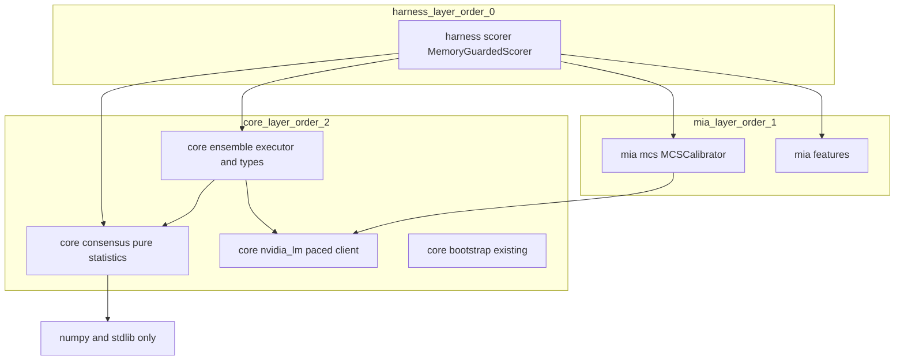
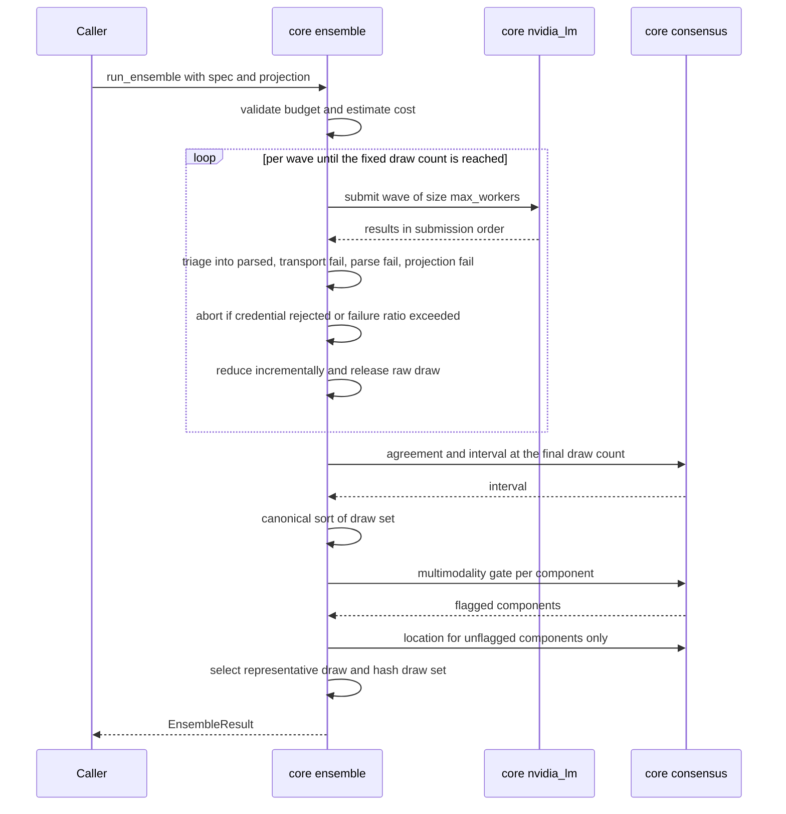
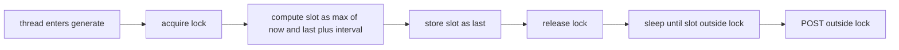

# Technical Design: ensemble-consensus

## Overview

**Purpose**: This feature delivers an opt-in N-draw consensus path to consumers of
`recall_guard`, turning a single nondeterministic model draw into a representative answer
plus an auditable confidence. Its highest-value consumer is the package's own contamination
score, `p_memorized`, whose single-draw 95% band spans two thirds of the unit interval while
directly scaling deployed exposure.

**Users**: Consumers of `MemoryGuardedScorer` who scale exposure by `p_memorized`, and
consumers of the LM client who need a decision to survive the serving stack's
nondeterminism. Every operator of the package benefits from the phase-1 concurrency repair
regardless of whether they ensemble.

**Impact**: Changes the LM client's pacing from a mutual-exclusion scheme that serialises all
concurrent requests into a slot-reservation scheme that permits genuine concurrency while
preserving the configured interval. Adds two new `core` modules and one new method on the
public scorer. Changes no existing signature or return type.

The design deliberately departs from the source proposal wherever that proposal's own
measurements refute it. Those departures, together with the decisions this spec adds on top of
them, are recorded in `research.md` and summarized in *Design Decisions* below. They are
settled, not open questions.

### Goals

- Concurrent requests through one LM client execute concurrently, with the pacing contract
  preserved and a regression test that actually fails on serialisation.
- An ensemble is selected per call, never process-wide, and the non-ensemble path is
  unchanged byte-for-byte.
- A reduction that refuses to report a location inside a distributional gap, and that reports
  a representative draw which is always an actually-observed draw.
- An ensembled `p_memorized` with an interval, reduced from per-draw scores produced by the
  unchanged single-draw scoring behavior.
- A reduction that is a pure, order-independent function of the draw set, so a stored draw
  set replays to a bit-identical result without re-querying.
- Cost knowable before execution and bounded during it.

### Non-Goals

- The consuming project's five-axis loadings vector, `REGIME_ASSET_EXPOSURE` asset map, and
  `factor_run.v1` / `replay_audit` artifact schema. `recall_guard` supplies a content hash
  and diagnostics; the consumer owns persistence.
- Changing what `p_memorized` estimates. The ensemble is a better estimator of the same
  estimand.
- A shared HTTP connection pool. Deferred: every test in `tests/core/test_nvidia_lm.py`
  patches module-level `requests.post` at 13 sites, and `requests.Session` is not formally
  thread-safe. Recorded as a follow-on.
- Sequential stopping in any form, including anytime-valid confidence sequences. Measured:
  the only statistically valid variant saves nothing at this cap, and always-valid bounds need
  roughly seven times it. See *Decision 5*.

## Boundary Commitments

### This Spec Owns

- The pacing/concurrency contract of `NvidiaLM` and its regression tests.
- The generic ensemble primitives: N-draw execution, reduction, agreement measurement,
  multimodality detection, interval construction, tie-breaking, and draw-set hashing.
- `EnsembleSpec` and `EnsembleResult` as stable public types, including their validation.
- `MemoryGuardedScorer.score_ensemble` and the `EnsembledScore` type.
- The definition of what the draw-set content hash covers.
- Request budgeting and pre-execution cost estimation.

### Out of Boundary

- Any domain-specific projection. The caller supplies the callable that maps a reply to a
  decision; this spec never assumes the projection is linear, ordered, or total.
- Artifact schemas, evidence tables, and replay tooling in consuming projects.
- The statistical objective of `p_memorized`, the MIA feature set, and the calibrator.
  Verified unchanged: `compute_mia_features` and `MCSCalibrator.predict_proba` are already
  bit-deterministic, so ensembling the LM call alone is sufficient and `mia/` needs no edit.
- Prompt design and response format.
- Connection pooling and HTTP session reuse.

### Allowed Dependencies

- New code may depend on `numpy` and the standard library only. No new runtime dependency,
  and specifically no `scipy` — it resolves transitively via scikit-learn but is undeclared,
  and `core/bootstrap.py` already states the house rule that scipy is intentionally avoided.
- `core/ensemble.py` may import `core.nvidia_lm` and `core.consensus` (same layer, permitted).
- `harness/scorer.py` may import `core.ensemble`, `core.consensus`, and `mia.mcs`.
- New modules must use absolute, module-direct imports. Relative imports and
  `from recall_guard import ...` inside a layer module are forbidden: the architecture gate
  does not inspect either, and the latter creates a root-`__init__` cycle against a zero-cycle
  ceiling.

### Revalidation Triggers

- Any change to the pacing contract's definition (start-to-start vs end-to-start).
- Any change to `EnsembleResult` / `EnsembledScore` field sets or to the tie-break rules,
  which would change a replayed consensus.
- Any change to what the draw-set hash covers.
- Any change to the multimodality thresholds, which changes which components get flagged.
- Any new layer registered in the architecture gate.

## Architecture

### Existing Architecture Analysis

The package enforces a layer order `harness=0`, `{dataset, mia, portfolio}=1`, `core=2`,
where a module may import only a strictly higher order number or its own layer. The gate is
implemented twice — in `.sentrux/rules.toml` and mirrored in `scripts/check_architecture.py`
— and has a blind spot this design must avoid: a module whose top directory is not registered in
`LAYERS` yields `src_order is None`, and all of its layer-direction checks are skipped — only
the banned-import check still fires, because that runs first. The blind spot is symmetric:
imports *into* an unregistered directory are equally invisible, since the destination order
also resolves to nothing. A new `recall_guard/ensemble/` package would therefore be
architecturally unpinned in both directions while CI stayed green. This design places all new
modules in `core/`, which needs no gate change and closes the blind spot by construction.

A second trap in the proposal's own API shape: putting the ensemble parameter on the client's
`generate` method would make the client and the ensemble module import each other. That is a
cycle against a zero-cycle ceiling — and the CI gate does not check cycles, so it would pass
CI and fail the structural tool. The entry point is therefore a free function taking a client,
which is also the package's established fan-out pattern.

Two pre-existing conditions constrain acceptance criteria:

- `sentrux check_rules` already fails on the current tree (`portfolio/backtest.py` has two
  functions over the 120-line ceiling). CI does not run sentrux. Acceptance must therefore be
  "no *new* violations", not "sentrux clean".
- `tests/test_packaging.py` pins the runtime dependency set and the extras set by **exact
  equality**. Any new runtime dependency or extra fails it.

The pacing defect is a regression from the `review-hardening` spec's task 2.3, which
satisfied its Req 2.6 ("while concurrent requests share one LM client instance with request
pacing enabled, the client shall enforce the configured pacing contract") by indenting the
pre-existing HTTP POST into a new `with self._pace_lock:` block. Req 2.6 must stay satisfied;
this design re-satisfies it with reservation rather than exclusion.

### Architecture Pattern and Boundary Map



**Architecture Integration**:

- Selected pattern: pure-core statistics plus a thin executor, with the domain-specific
  decision supplied as an injected callback. Chosen because `core` at order 2 is the only
  location reachable from every upper layer; placing the reduction in `mia` would wall it off
  from `portfolio` and `dataset`, which are equal-order siblings forbidden in both directions.
- Domain boundaries: `core/consensus.py` holds no I/O and no domain knowledge; `core/ensemble.py`
  holds execution and result assembly; `harness/scorer.py` holds the contamination-score
  specialisation. The projection callback is the seam that keeps macro-domain knowledge out.
- Existing patterns preserved: fan-out as a free function (matching `generate_many`) rather
  than a parameter on `generate`; validate-on-construct raising `ValueError` (matching
  `NvidiaLM.__init__`); hand-rolled numpy statistics with scipy avoided (matching
  `core/bootstrap.py`); frozen dataclasses for all result records.
- Steering compliance: no new runtime dependency; `import recall_guard` stays free of
  matplotlib and vectorbt; no second scoring path — the ensemble wraps the existing
  per-draw scoring rather than reimplementing it.

### Technology Stack

| Layer | Choice / Version | Role in Feature | Notes |
|-------|------------------|-----------------|-------|
| Runtime / statistics | `numpy >= 1.26` (already a dependency) | Sorting, unique-with-counts, array reduction | No new dependency |
| Runtime / normal quantile | `statistics.NormalDist().inv_cdf` (stdlib) | Wilson `z` | Matches `scipy.stats.norm.ppf` to 4.4e-16; avoids an undeclared scipy import |
| Runtime / exact summation | `math.fsum` (stdlib) | Order-independent means | Removes a measured float nondeterminism, see *Decision 7* |
| Runtime / concurrency | `concurrent.futures.ThreadPoolExecutor` (stdlib) | Wave execution | Already imported by `core/nvidia_lm.py` |
| Runtime / hashing | `hashlib.sha256` + `json` (stdlib) | Canonical draw-set hash | Full 64 hex, not the 16-char prompt-hash truncation |
| Transport | `requests >= 2.31` (already a dependency) | Unchanged | No `Session`; see Non-Goals |

## File Structure Plan

### Directory Structure

```
recall_guard/
├── core/
│   ├── consensus.py       # NEW - pure statistics, numpy + stdlib, no I/O
│   ├── ensemble.py        # NEW - EnsembleSpec, EnsembleResult, wave executor, hashing
│   ├── nvidia_lm.py       # MODIFIED - slot-reservation pacing
│   ├── bootstrap.py       # unchanged - reused for interval construction
│   └── __init__.py        # MODIFIED - re-export new public names
├── harness/
│   └── scorer.py          # MODIFIED - score_ensemble, EnsembledScore
└── __init__.py            # MODIFIED - root re-export + __all__
tests/
├── core/
│   ├── test_nvidia_lm.py  # MODIFIED - add concurrency + retry-pacing tests
│   ├── test_consensus.py  # NEW - the measured pathologies as the test corpus
│   └── test_ensemble.py   # NEW - executor, validation, determinism, replay
├── fixtures/
│   ├── dispersion_draws.csv   # NEW - vendored measured draws, numeric columns only
│   └── dispersion_guard.csv   # NEW - vendored measured contamination scores
└── harness/
    └── test_scorer.py     # MODIFIED - degenerate-parity + failure-semantics tests
```

**On the vendored fixtures.** The pathology tests are the point of this design — the
zero-dispersion component, the separated clusters, the trim landing in the gap, the mean
landing in a bin almost nothing occupies. Every one of them is a property of measured data
that currently lives in a *different repository*, which `recall_guard` cannot import. Without
vendoring, those tests cannot be written and the design's central claims go unguarded. Only
the numeric columns are carried — the draw index, the parse flag, the five component values,
and the contamination scores — so no prompt or reply text is copied and the pair lands at
roughly 50 KB, in line with the existing fixtures.

### Modified Files

- `recall_guard/core/nvidia_lm.py` — replace the mutual-exclusion `_paced_post` with a
  `_reserve_call_slot` helper; sleep and POST outside the lock.
- `recall_guard/core/__init__.py` — add new names to both the import block and `__all__`
  (the module docstring states `__all__` is a fail-fast typo guard).
- `recall_guard/harness/scorer.py` — add `score_ensemble` and `EnsembledScore`; decompose
  rather than extend `_build_guarded_score`, which is already 44 lines.
- `recall_guard/harness/runner.py` — change the `--max-workers` default from 8 to 1.
- `recall_guard/__init__.py` — add imports and `__all__` entries. No new name may begin with
  `plot_`; the lean-import subprocess test asserts this.
- `.kiro/steering/recall-guard-package.md` — record the new public surface and the pacing
  contract change.
- `docs/` — describe the ensemble surface. The docs build is strict, docstring style is
  numpy, and reference pages are auto-generated per module, so any unresolved cross-reference
  in a new docstring fails the build.

## System Flows

### Ensemble execution, wave-based



Two decisions carry the design's weight. The multimodality gate runs **before** any location
estimate, so a flagged component never receives one — the source proposal presents these as
parallel features, but they are sequential and the order is load-bearing. And the draw count
is fixed, so the interval is computed once at the end and is exactly valid; waves exist for
budget enforcement, credential abort, and incremental reduction, not for stopping.

### Pacing: reservation instead of exclusion



The lock now spans three arithmetic operations rather than a network round trip, so the
critical section no longer scales with either the pacing interval or the round-trip time.

## Requirements Traceability

| Requirement | Summary | Components | Interfaces | Flows |
|-------------|---------|------------|------------|-------|
| 1.1, 1.3, 1.7 | Concurrent requests overlap | `NvidiaLM` | `_reserve_call_slot` | Pacing |
| 1.2, 1.5 | Interval preserved, start-to-start | `NvidiaLM` | `_reserve_call_slot` | Pacing |
| 1.4 | Retries consume a slot | `NvidiaLM` | retry loop | Pacing |
| 1.6 | Regression test exists | `tests/core/test_nvidia_lm.py` | — | — |
| 1.8 | CLI defaults to one worker | `harness/runner.py` | `--max-workers` | — |
| 1.9 | Jitter ships with the repair | `NvidiaLM` retry loop | — | Pacing |
| 2.1, 2.2, 2.3 | Opt-in per call, no implicit default | `EnsembleSpec`, `run_ensemble` | `generate_ensemble`, `score_ensemble` | Ensemble |
| 2.4, 2.5, 2.6, 2.7 | Validate on construct, certification feasibility | `EnsembleSpec.__post_init__` | `smallest_certifiable_n` | — |
| 3.1, 3.2 | Unsnapped location, separate snap | `consensus.robust_location` | `EnsembleResult.location` | Ensemble |
| 3.3, 3.4, 3.5 | Lattice declared, adherence reported | `consensus.grid_adherence` | `EnsembleSpec.grid` | Ensemble |
| 3.6, 3.7 | Representative is a real draw, order-free tie-break | `ensemble.select_consensus` | `EnsembleResult.consensus` | Ensemble |
| 4.1, 4.2, 4.3, 4.4, 4.5 | Multimodality gates location | `consensus.detect_multimodal` | `EnsembleResult.multimodal` | Ensemble |
| 4.6, 4.7 | Thresholds configurable, limits documented | `EnsembleSpec` | — | — |
| 5.1, 5.2, 5.3 | Decision-space agreement, fixed-n Wilson | `consensus.wilson_interval` | `EnsembleResult.agreement_ci` | Ensemble |
| 5.4, 5.5 | iid documented, projection failure distinct | `ensemble.partition` | `EnsembleResult.n_projection_failed` | Ensemble |
| 5.6 | Tail convention declared and used | `EnsembleSpec` | `confidence`, `tail` | — |
| 5.7, 5.8 | Dependence measured and reproducible | `consensus.lag_dependence` | `EnsembleResult.draw_dependence` | Ensemble |
| 6.1, 6.2, 6.3, 6.8 | Ensembled score, parity preserved | `MemoryGuardedScorer.score_ensemble` | `EnsembledScore` | Ensemble |
| 6.9 | One designated multiplier | `EnsembledScore` | `p_memorized_point` | Ensemble |
| 6.10 | Shared-reference caveat documented | docs | `EnsembleSpec.reference_mode` | — |
| 6.11 | Estimator difference stated as withheld exposure | docs | — | — |
| 6.4, 6.5, 6.6 | No symmetric trim, unbiased default | `scorer` reduction | `conservative_quantile` | — |
| 6.7 | Reference-model policy explicit | `EnsembleSpec.reference_mode` | — | — |
| 7.1, 7.2 | Requested vs parsed, taxonomy | `ensemble.partition` | `EnsembleResult` counters | Ensemble |
| 7.3, 7.4, 7.5 | Fail rather than thin success | `run_ensemble` | — | Ensemble |
| 7.6, 7.7 | Status-based auth, abort | `NvidiaLM`, `run_ensemble` | — | Ensemble |
| 7.8 | Dropout bias documented | docs | — | — |
| 8.1, 8.2, 8.3 | Budget and dry-run estimate | `EnsembleSpec`, `estimate_cost` | `CostEstimate` | — |
| 8.4 | Concurrency default matches package | `EnsembleSpec.max_workers` | — | — |
| 8.5, 8.6 | Jitter and Retry-After | `NvidiaLM` retry loop | — | Pacing |
| 8.7, 8.8 | Quota documented, no default retention | docs, `EnsembleSpec.retain_draws` | — | — |
| 9.1, 9.2, 9.3 | Pure, order-free, no RNG | `consensus`, `ensemble` | — | Ensemble |
| 9.4 | Tie-breaks content-only | all selection steps | — | — |
| 9.5 | Hash scope documented | `ensemble.canonical_draw_hash` | `draws_sha256` | Ensemble |
| 9.6 | Replay test | `tests/core/test_ensemble.py` | — | — |
| 10.1 | No new runtime dependency | packaging | `pyproject` deps | — |
| 10.2 | Lean import preserved | root `__init__` | `__all__` | — |
| 10.3 | Layering check registered, not skipped | `core/consensus.py`, `core/ensemble.py` | — | — |
| 10.4 | No new complexity violation | all new units | — | — |
| 10.5 | Existing public types unchanged | `GuardedScore`, `score`, `score_many` | — | — |
| 10.6 | Ensemble surface documented | docs | — | — |

## Components and Interfaces

| Component | Layer | Intent | Req Coverage | Key Dependencies | Contracts |
|-----------|-------|--------|--------------|------------------|-----------|
| `NvidiaLM` (modified) | core (2) | Paced client permitting real concurrency | 1.1–1.7, 7.6, 8.5, 8.6 | `requests` (P0) | Service, State |
| `core/consensus.py` | core (2) | Pure statistics over a draw set | 3.x, 4.x, 5.1–5.3, 9.1–9.4 | `numpy` (P0) | Service |
| `core/ensemble.py` | core (2) | Spec, result, wave executor, hashing | 2.x, 5.4–5.7, 7.x, 8.x, 9.x | `core.nvidia_lm` (P0), `core.consensus` (P0) | Service, State |
| `MemoryGuardedScorer` (modified) | harness (0) | Ensembled contamination score | 6.x | `core.ensemble` (P0), `mia.mcs` (P0) | Service |

### Core layer

#### NvidiaLM pacing

| Field | Detail |
|-------|--------|
| Intent | Enforce the call-interval contract without serialising concurrent requests |
| Requirements | 1.1, 1.2, 1.3, 1.4, 1.5, 1.7, 7.6, 8.5, 8.6 |

**Responsibilities and Constraints**

- Owns `_last_call_t` and `_pace_lock`. The lock protects only the reservation arithmetic.
- The pacing contract is redefined as **start-to-start**. Today `_last_call_t` is stamped
  after the response returns, making the effective spacing `interval + round_trip_time`;
  after the change it is the reserved send time, making spacing exactly `interval` and
  independent of latency. This is a deliberate, documented contract tightening.
- Each retry attempt reserves its own slot. Today the pacing stamp is only skipped when
  `requests.post` itself raises — a transport-level failure — because a rate-limited response
  is a *successful* POST that stamps the clock before status checking raises. Measured on the
  current code: retries after an injected transport error restart at 0.0001 s gaps
  (unpaced), while retries after an HTTP 429 are correctly spaced at the configured interval.
  The exposed case is therefore a fast-failing connection error, not rate limiting; a real
  timeout self-paces because it costs the full timeout in wall clock. Reservation closes the
  gap uniformly, and the accompanying test should inject a connection error rather than a 429.

**Contracts**: Service [x] / State [x]

##### Service Interface

```python
def _reserve_call_slot(self) -> float:
    """Reserve the next paced send slot; return seconds to wait before POST."""
```

- Preconditions: none.
- Postconditions: returns `>= 0.0`; `_last_call_t` is monotonically non-decreasing.
- Invariants: successive reserved slots differ by at least `min_call_interval_s` when that is
  positive; `max(now, ...)` prevents an idle client from banking credit and then bursting.

**Implementation Notes**

- Integration: `generate` shrinks from 98 lines; the helper keeps it inside the 120-line
  ceiling.
- Validation: the existing concurrency test's discriminating power must be preserved. It
  asserts a *lower* bound on sorted request-start gaps and passes both before and after this
  change — and it is the only assertion that rejects the naive variant which stamps
  `_last_call_t` to the current clock rather than to the reserved slot. That variant fails it
  5 runs out of 5, so it pins the reservation semantics and must not simply be deleted.
  One caveat: today the lock serialises requests, so a measured gap can never undershoot.
  After the change each thread sleeps to its own slot and sends outside the lock, so scheduler
  jitter above the test's tolerance could compress a gap below the floor under CI load. If
  that proves flaky, widen the tolerance or assert on reserved slots rather than observed send
  times — do not weaken the assertion into one the naive variant would also pass.
- Validation: the executor keeps `generate`'s existing call shape. The test doubles across the
  suite define `generate` without a token-budget parameter, so introducing a new call shape
  raises a type error in a dozen currently-green tests. This costs nothing, because the
  measured dispersion occurs at the shipped defaults; changing the call shape would be a
  separately budgeted task.
- Validation: per-draw scoring is safe to run concurrently against one shared baseline and
  calibrator — the calibrator is a frozen dataclass whose prediction path only reads its
  fitted state and allocates fresh arrays, and the feature computation is pure. No per-thread
  calibrator copy is needed once the pacing repair lands.
- Risks: the serialisation has been acting as an accidental global rate limiter. After the
  fix the CLI's documented `--max-workers` default of 8 will genuinely emit 8 concurrent
  requests where it previously emitted 1. This must be documented, and jitter plus
  `Retry-After` handling are part of the same phase rather than a follow-on.

#### core/consensus.py

| Field | Detail |
|-------|--------|
| Intent | Pure, deterministic statistics over a draw set; no I/O, no domain knowledge |
| Requirements | 3.1–3.5, 4.1–4.3, 4.6, 5.1–5.3, 9.1–9.4 |

**Responsibilities and Constraints**

- No RNG anywhere on the consensus path, so no seed needs storing. If a bootstrap band is
  ever added it is a separate reported field with its own persisted seed.
- All means use `math.fsum` over a sorted core. Measured: `np.mean` over 2000 shuffles of the
  same 977 values yields two distinct float results, because pairwise summation depends on
  array order. A last-bit difference changes the artifact hash and can flip a comparison at a
  lattice boundary.

**Contracts**: Service [x]

##### Service Interface

```python
def wilson_interval(k: int, n: int, *, confidence: float = 0.95,
                    continuity: bool = False) -> tuple[float, float]: ...

def robust_location(values: Sequence[float], *, mode: LocationMode) -> float: ...

def snap_to_grid(value: float, grid: float) -> float: ...

def grid_adherence(values: Sequence[float], grid: float) -> float: ...

def detect_multimodal(values: Sequence[float], *, grid: float,
                      mass_min: float, trough_steps: int,
                      density_ratio: float) -> MultimodalVerdict | None: ...

def lag_dependence(labels: Sequence[Hashable],
                   groups: Sequence[int]) -> float | None: ...
```

- Preconditions: `n >= 0`; `0 <= k <= n`; `grid > 0` where supplied.
- Postconditions: `wilson_interval` returns bounds within `[0, 1]`, never zero-width at
  `k == n`. `detect_multimodal` returns `None` when no lattice is supplied.
- Invariants: every function is a pure function of its arguments and independent of argument
  order except where order is the meaning.

**Implementation Notes**

- Integration: `z` comes from `statistics.NormalDist().inv_cdf`, not scipy.
- Validation: the measured pathologies are the test corpus — the axis whose MAD is exactly
  zero, the axis where the modified z-score flags 29.2%, the 36/4/63 split, and the mean
  landing in a bin holding 0.5% of draws.
- Risks: `detect_multimodal` is the only unit at complexity risk; keep the split search in its
  own helper.

#### core/ensemble.py

| Field | Detail |
|-------|--------|
| Intent | Configuration, execution, triage, result assembly, hashing |
| Requirements | 2.1–2.7, 5.4–5.7, 7.1–7.7, 8.1–8.4, 8.8, 9.1–9.6 |

**Contracts**: Service [x] / State [x]

##### Service Interface

```python
@dataclass(frozen=True)
class EnsembleSpec:
    draws: int = 64
    max_workers: int = 8
    min_parsed: int = 24
    grid: float | None = None
    confidence: float = 0.95
    tail: Tail = Tail.ONE_SIDED                      # pinned; drives the feasibility check
    agreement_target: float | None = None            # certification target, not a stop trigger
    location_mode: LocationMode = LocationMode.MEDIAN
    multimodal_action: MultimodalAction = MultimodalAction.FLAG
    mass_min: float = 0.25
    trough_steps: int = 3
    density_ratio: float = 10.0
    max_total_requests: int | None = None
    max_transport_failure_ratio: float = 0.25
    retain_draws: bool = False
    reference_mode: ReferenceMode = ReferenceMode.FIXED

    def __post_init__(self) -> None: ...          # raises ValueError
    @property
    def smallest_certifiable_n(self) -> int | None: ...

def generate_ensemble(lm: NvidiaLM, prompt: str, spec: EnsembleSpec, *,
                      decide: Callable[[CompletionResult], Hashable],
                      components: Callable[[CompletionResult], Mapping[str, float]] | None = None,
                      ) -> EnsembleResult: ...

def estimate_cost(spec: EnsembleSpec, *, max_retries: int,
                  has_reference: bool) -> CostEstimate: ...

def canonical_draw_hash(draws: Sequence[str]) -> str: ...
```

- Preconditions: `1 <= min_parsed <= draws`; `max_workers >= 1`; `grid is None or grid > 0`;
  `0 < confidence < 1`; if `agreement_target` is set then `smallest_certifiable_n <= draws`,
  evaluated against the declared `tail`.
- Postconditions: `n_requested >= n_parsed`; `location` keys are exactly the unflagged
  components; `consensus` is an element of the observed draw set.
- Invariants: the reduction is a pure function of the canonically-ordered draw set.

**Implementation Notes**

- The executor is a **new** primitive rather than a reuse of `generate_many`, for two
  structural reasons. `generate_many` drives its executor with `ex.map`, which blocks until
  every future resolves and yields results only as a complete list. An ensemble needs results
  wave by wave — to enforce the request budget, to abort on a rejected credential without
  paying for the remaining draws, and to reduce incrementally so full responses are released
  rather than accumulated. None of those are expressible over a call that returns everything
  at once. Note the executor does *not* need to vary temperature: the measured dispersion
  occurs at `temperature=0` and originates in the serving stack, which is the premise of the
  whole feature.
- The endpoint payload carries no seed field, so replay is not reproducible from a seed. The
  content hash must therefore cover observed reply text, and reproducibility is a property of
  the *stored* draw set rather than of a re-execution.
- A canonical hashing primitive belongs in `core`. The existing prompt-hash helper lives in
  `harness`, which `core` may not import, and it truncates to 16 hex characters where a
  draw-set hash should not.
- Integration: two callbacks, not one. `decide` returns a `Hashable` and drives agreement;
  `components` optionally returns named scalars and drives location and multimodality. A
  single callback cannot serve both — "median" is undefined for an arbitrary return type, and
  the categorical and scalar cases are different reduction algorithms.
- Validation: `estimate_cost` must be callable without issuing any request.
- Risks: memory. The client always requests 20 top-logprobs per token; at the study's token
  budget that is roughly 12 MB per draw, so retaining 128 full draws is about 1.5 GB.
  `retain_draws` therefore defaults to `False` and the executor reduces incrementally,
  keeping only the content hash, decision, and per-draw derived scalars.

### Harness layer

#### MemoryGuardedScorer.score_ensemble

| Field | Detail |
|-------|--------|
| Intent | Ensembled contamination score over the unchanged per-draw scoring behavior |
| Requirements | 6.1–6.8 |

**Contracts**: Service [x]

##### Service Interface

```python
@dataclass(frozen=True)
class EnsembledScore:
    consensus: GuardedScore                     # an actual draw, unchanged construction
    p_memorized_point: float | None
    p_memorized_ci: tuple[float, float] | None
    p_memorized_conservative: float | None
    agreement: float | None
    agreement_ci: tuple[float, float] | None
    draw_dependence: float | None
    multimodal: tuple[str, ...]
    n_requested: int
    n_parsed: int
    fail_counts: tuple[tuple[str, int], ...]    # tuple of pairs, not a dict
    draws_sha256: str
    draws: tuple[GuardedScore, ...]             # empty unless retain_draws

def score_ensemble(self, prompt: str, *, spec: EnsembleSpec,
                   conservative_quantile: float | None = None) -> EnsembledScore: ...
```

- Preconditions: `spec` is explicitly supplied; there is no implicit default.
- Postconditions: `p_memorized_point is None` if and only if `consensus.parse_ok is False`.
  Never `0.0` on failure — the existing single-draw path returns `None`, and downstream
  consumers exclude `None` from their distributions while `0.0` would mean "pass 100% of
  exposure through".
- Invariants: `score` and `score_many` signatures and return types are untouched.

**Precedence between `consensus.p_memorized` and `p_memorized_point` — pinned.**
`p_memorized_point` is the multiplier. `consensus.p_memorized` is evidence and must never be
used to scale exposure. This has to be stated because the two can disagree: ranking the
representative draw by an arbitrary decision projection selects a draw whose own score is
unrelated to the reduced location. Concretely, for three draws with `(projection, score)` of
`(0.1, 0.90)`, `(0.5, 0.20)`, `(0.9, 0.50)`, the median-by-projection draw carries `0.20`
while the median of the scores is `0.50`. Left undocumented this recreates, inside the
composed type, exactly the two-readings ambiguity that ruled out extending the existing score
type. On the guard path the executor therefore ranks the representative draw **by
`p_memorized` itself**, which makes the two agree by construction at odd draw counts; at even
counts the lower order statistic is used, never the midpoint of two draws, which would be
synthetic.

**Implementation Notes**

- Integration: composition, not inheritance or field-extension. A subclass of `GuardedScore`
  would compare unequal to a `GuardedScore` with identical fields in both directions, because
  dataclass equality compares classes — a silent trap for downstream fixtures. Appending
  optional fields to `GuardedScore` would instead force an unresolvable ambiguity about
  whether `p_memorized` holds the consensus draw's value or the reduced location.
- Validation: every collection field is a `tuple`. `GuardedScore` is hashable today; a `dict`
  or `list` field would break `hash()`.
- Risks: the existing parity test calls `scorer.score(prompt)` bare and must stay unchanged.
  Add a degenerate-parity test asserting that a one-draw ensemble reproduces the single-draw
  score exactly — that is what makes the ensemble a strict superset.

## Data Models

### Domain Model

- **Draw** — one reply plus its derived scalars. Identity is the SHA-256 of its content.
- **Draw set** — an ordered sequence of draws, canonically sorted before any reduction.
  Ordering is by the component tuple in declared order, then by content hash.
- **Component** — a named scalar extracted from a draw by the caller's `components` callback.
- **Decision** — a hashable value extracted by the caller's `decide` callback. Agreement is
  the share of draws whose decision equals the modal decision.

Invariants: a reduction never sees arrival order; a flagged component has no location; the
representative draw is a member of the draw set.

### Data Contracts

- `draws_sha256` covers the **ordered sequence of reply content strings only**, never
  logprobs. Logprob dict key order comes from the JSON response and is fragile across servers
  and library versions. The preimage carries an explicit version tag, an explicit separator,
  and UTF-8 encoding; the hash identifies a draw *sequence*, not a set.
- Serialization for hashing pins float formatting via `repr()` (round-trip exact), key
  ordering via `sort_keys=True`, and compact separators. Excluded: latency, wall-clock,
  thread identity, arrival index.

## Error Handling

### Error Strategy

Validation errors raise at construction, matching `NvidiaLM.__init__`'s style rather than
`generate_many`'s silent clamping. Runtime failures are counted and surfaced; they never
become a synthesized success.

### Error Categories and Responses

**Configuration errors** (`ValueError`, at construction): `min_parsed > draws`; non-positive
grid; an `agreement_target` that cannot be certified at `draws` under the declared tail;
`max_workers < 1`; an undeclared tail convention.

**Transport failures** (per draw, counted): timeout, retryable HTTP, connection error. Counted
into `fail_counts` under the taxonomy the package already distinguishes. Never imputed.

**Credential rejection** (raises, aborts): classified from the response status code, not by
substring-matching `"401"` in the error text. The current substring match would false-positive
on any message containing those digits — a trace id, a port, a byte count — and under 128
draws that exposure is 128× the single-draw exposure, where one false positive aborts an
entire ensemble and discards every already-computed result. On genuine rejection the executor
stops issuing further draws rather than paying for the full count.

**Projection failures** (per draw, counted separately): the caller's callback raised. This is a
third failure class, distinct from transport and parse, and must not be folded into either.

**Insufficient sample** (fails the ensemble): `n_parsed < min_parsed`, or transport failures
exceeding `max_transport_failure_ratio`. A "success" over a handful of survivors is exactly
the false-success artifact the `review-hardening` spec forbids, and it is the specific failure
mode where a synchronized 429 storm produces a confident consensus over four draws.

### Monitoring

`EnsembleResult` carries `n_requested`, `n_parsed`, the per-category `fail_counts`, and
`grid_adherence`. These are reported values, not log lines: draw failures are not
missing-at-random. Timeouts and token-budget truncation censor long or slow generations, so
the surviving draws are a length-conditioned subsample. The direction of the resulting shift
is unknown — the loss feature is length-normalized and the compression feature scales in both
numerator and denominator, so neither moves mechanically with truncation — which is precisely
why the counts must attenuate reported confidence rather than be discarded or assumed benign.

## Testing Strategy

### Unit Tests

- `wilson_interval` at `k == n` for several `n`, asserting non-zero width and containment in
  `[0, 1]`; comparison against the Wald interval to pin why Wald is rejected.
- `detect_multimodal` on the measured 36/4/63 split (must flag) and on the pinned axis with
  sd 0.033 (must not flag), at draw counts 24, 64, and 128.
- `robust_location` on the axis whose MAD is exactly zero, and on the bimodal axis where every
  symmetric trim fraction lands inside the trough.
- `snap_to_grid` across all half-step tie values in `[-1, 1]`, asserting a single pinned
  rounding direction.
- `EnsembleSpec.__post_init__` rejects each invalid combination, including an unreachable
  agreement target.

### Integration Tests

- Degenerate parity: a one-draw ensemble reproduces `score(prompt)` exactly.
- Replay determinism: a fixed stored draw set reduces to a bit-identical result, with the draw
  set shuffled between runs, and with no model contacted.
- Failure semantics: all draws fail; most draws fail; one draw returns a credential rejection.
- Multimodality gating: a flagged component receives no location estimate.

### Performance Tests

- Concurrency: N slow mocked requests across W workers complete in wall-clock proportional to
  `N/W`, not `N`. This test must fail on the current code.
- Pacing preserved: request starts remain spaced by the configured interval and are *not*
  inflated by request latency.
- Retry pacing: a failed attempt still consumes a pacing slot.

## Security Considerations

The credential-rejection classifier moves from substring matching to response status, which
removes a false-positive path that would otherwise abort ensembles and, more importantly,
stops error text from being interpreted as an authorization signal. Ensemble mode multiplies
request consumption by the draw count, and by the retry count and reference model on top of
that; the documentation must state that the operator owns their own quota and terms, and the
request budget must be enforced by a counter that raises rather than by convention.

## Performance and Scalability

Post-fix throughput is `min(max_workers / latency, 1 / min_call_interval_s)`. The pacing
interval therefore bounds ensemble throughput, and the measured field figure of 260 draws per
minute was obtained with **thread-local clients**, i.e. independent pacers, which silently
multiplies the configured provider rate limit by the worker count. That workaround and this
fix do not have the same rate semantics, and the workaround must not be blessed as the design.

The proposal's "~370×" figure is not carried into this spec: with 32 workers the theoretical
ceiling of de-serialising is 32×, so the claim exceeds its own ceiling by an order of
magnitude and reflects something other than the lock. The defensible claim is "up to
`max_workers`×", and phase 1's acceptance criterion is a reproducible mocked benchmark rather
than a field anecdote.

## Design Decisions

Each of the following departs from the source proposal. Full derivations, measured tables, and
the scripts that produced them are in `research.md`.

1. **The emission lattice is caller-declared and optional, never assumed.** The proposal's
   `grid = 0.1` default is refuted by its own data: 17.6% of measured values are off that
   lattice, and the second-most-common value on the tightest axis — occurring in 41% of its
   draws — is off it. `p_memorized` is continuous. `grid` becomes `float | None`, defaulting
   to `None`, with a reported adherence diagnostic.

2. **Multimodality gates location; it does not run beside it.** No symmetric trim fraction
   rescues the bimodal axis: even at the maximal 25% trim the estimate lands inside the
   measured trough. Trimming is a heavy-tail remedy and this is a mixture problem.

3. **Location is reported unsnapped.** Snapping degrades accuracy on every measured axis and
   introduces a systematic bias on the best-estimated one, shifting the downstream decision
   statistic by an amount comparable to half the entire spread between candidate estimators.
   Snapping becomes reporting, not estimation.

4. **The multimodality detector is the lattice heuristic, retuned.** The dip test is rejected
   on four independent grounds: its mature implementations are GPL-2 against an MIT package,
   it costs seconds at the operating point on continuous data, it is easy to get silently
   inverted, and — measured — its ranking on this data is inverted, scoring the most unimodal
   axis at 2.5× the genuinely bimodal one, because it detects tie mass rather than modality.
   The bimodality coefficient flags the pinned axis 36% of the time at low draw counts. The
   proposal's own heuristic is the only candidate defined natively on the lattice, but its
   stated mass threshold false-positives on a third axis in 13–31% of ensembles; raising it
   separates cleanly.

5. **No sequential stopping at all, and the interval's tail must be declared.** Checking a
   Wilson bound after every draw is optional stopping: measured miscoverage rises from 5%
   nominal to 17.6% actual. Correcting for multiplicity restores validity but then saves
   **nothing** — the corrected schedule's last look is the cap, so it never fires early — and
   always-valid alternatives need roughly seven times the cap. Since the point estimate is
   stable well below the cap anyway, a fixed draw count is simultaneously cheaper than the only
   valid sequential variant and exactly valid with no correction, no descriptive-versus-
   inferential caveat, and no stopping point to make replayable. Shipping the machinery would
   mean carrying configuration surface, a validation branch, and a replay concern for a feature
   that, done honestly, does nothing.
   The tail convention is still required, because the *certification* question survives: a
   caller asking to certify 0.95 needs at least 52 draws one-sided or 73 two-sided, and the
   proposal never says which tail it means. This design pins it, defaulting to one-sided.

6. **The representative draw is chosen by modal class then in-parameter-space medoid.**
   "Nearest the decision-space median" is not well-posed. At even draw counts a tie exists
   **with probability one by construction**, because the median of an even sample is the
   midpoint of the two middle order statistics and both are exactly equidistant from it; the
   73–82% figure obtained under exact float equality is an artifact of last-bit rounding, and
   with a tolerance the measured rate is 100%. So the representative draw — the headline
   output, and the thing an audit trail persists — is decided by arrival order in every
   even-count ensemble. Separately, one projection cannot serve both reductions: agreement
   requires a categorical outcome while "nearest the median" requires an ordered scalar, and
   the proposal supplies one callback without saying which. Measured, the representative draw
   and the per-component location already disagree on at least one component with no
   documented precedence.

7. **All tie-breaks and summations are pinned.** Enumerated: draw ordering, hash
   canonicalization, summation order, trim index, modal ties, representative-draw ties,
   even-count medians, lattice half-step rounding, and cluster-split selection. Each resolves
   by draw content alone.

8. **The contamination score defaults to an estimator unbiased for attenuation.** Attenuation
   is linear in the score, so the mean is unbiased for expected attenuation while the median
   of this right-skewed distribution sits materially lower and therefore under-attenuates —
   the unsafe direction, by roughly 8 percentage points of gross exposure at the measured
   values. Symmetric trimming is forbidden here outright: the right tail is the contamination
   evidence the score exists to report. A conservative upper quantile is available on request.

9. **The command-line worker default drops from 8 to 1.** That default has never done
   anything: with the client serialising, an operator running with it has always issued one
   request at a time. Repairing the lock without changing the default would silently octuple
   every existing operator's request rate against a rate-limited endpoint, on upgrade, with no
   action on their part — and the help text has been promising that concurrency all along, so
   nobody would read the release note as a warning. Making it explicit costs one line, keeps
   the honest behavior available to anyone who asks for it, and means the repair is a
   correctness fix rather than a traffic event. The retry jitter ships in the same release for
   the same reason: shipping real concurrency before jitter would put synchronized retry storms
   in front of users in the interval between the two.

10. **Draw dependence is measured, not merely disclaimed.** The reported interval assumes
   independent draws, and that is the assumption a serving stack is most likely to violate —
   continuous batching co-schedules concurrent requests, prefix-cache reuse couples
   near-simultaneous identical prompts, node affinity pins a burst to one accelerator, and load
   is time-correlated. All of those induce positive dependence, and positive dependence makes
   every reported interval **narrower than its label**, in the one direction that matters for a
   feature whose entire product is an honest confidence. Documenting the assumption ships the
   caveat without ever testing it.
   The measure is deliberately minimal: each draw carries the wave it was collected in, and the
   diagnostic is the association between decision labels across wave boundaries. It does not
   *correct* the interval — that would need a design-effect model this evidence does not support
   — it makes the assumption falsifiable, so a caller can see when the number is not to be
   trusted.
   One subtlety has to be pinned, because it looks like a contradiction. The reduction is
   order-independent by construction, yet dependence is inherently about collection order. These
   coexist because the wave label is *stored data*, not arrival order: the draws are canonically
   sorted for reduction and hashing, while the diagnostic reads the recorded wave labels. It is
   therefore still a pure function of the persisted draw set and replays identically. The wave
   label is excluded from the content hash, which continues to cover reply text only.

11. **The reference-model draw is held fixed, and the cost of that is stated.** Varying it per
   draw would account for reference variance correctly but doubles the request count on the
   guard path — the consumer the spec prioritises — for one of four features. Holding it fixed
   is the right default, but it is not free and the docstring must say so: with a shared
   reference, every draw's score is correlated through it, so the reported dispersion
   **understates** the true dispersion. That is the same direction of error as unmeasured draw
   dependence, so the two caveats compound rather than offset, and the documentation states
   them together rather than in separate places where a reader might meet only one.

## Deferred follow-ons

- **A shared HTTP connection pool.** Without one, each draw pays a fresh TCP and TLS
  handshake. Deferred rather than rejected: the measured field throughput was achieved with
  per-call sessions too, so it is not required to hit the target, and switching would
  invalidate the thirteen sites that patch the module-level request function. Revisit if
  post-repair throughput disappoints.
- **Re-tuning the cluster-detection constants across regimes.** Every one descends from a
  single crisis-onset date. They ship as configuration with provisional defaults; a second
  measured regime would let them be defaulted with more confidence, and would settle whether
  the disagreeing component is bimodal in calm conditions at all.
- **Correcting the interval for measured dependence.** This spec measures dependence and
  reports it; turning that measurement into a design-effect adjustment of the interval needs
  more than one date's evidence to justify a specific model.
