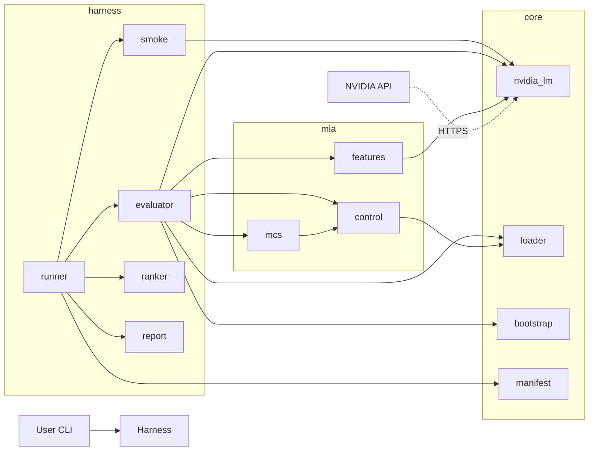
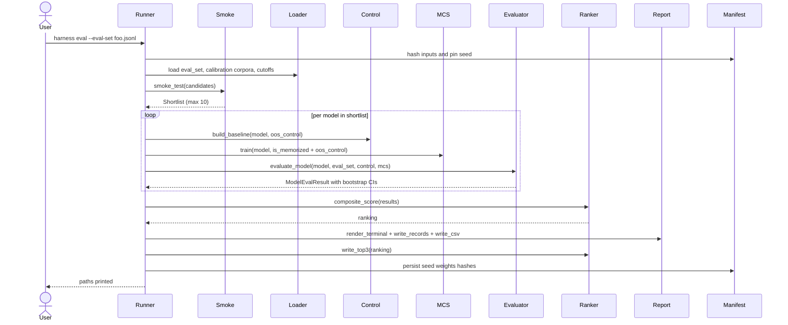
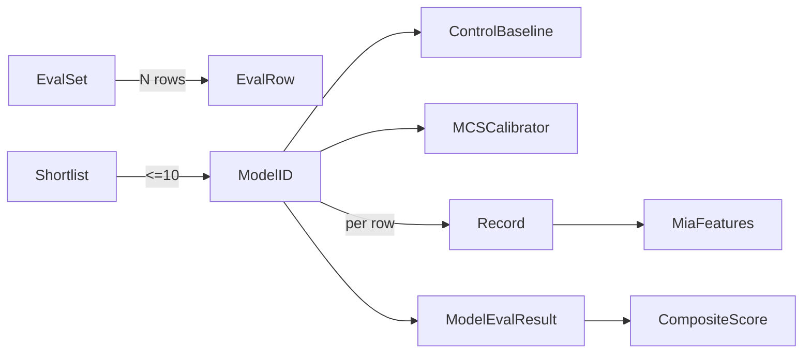

# Design

## How to read this doc

This is the architectural plan that requirements.md was implemented against. Sections are ordered by what you usually need to find:

1. **Overview** — what the harness is and what it replaces.
2. **Boundary commitments** — what this spec owns, what it doesn't, and what the dependency rules are. Read this if you're modifying the code.
3. **Architecture** — the three-layer module graph (core ← mia ← harness) and a Mermaid diagram of the run flow.
4. **File structure plan** — where every file lives.
5. **Components and interfaces** — per-module contracts, dataclasses, and signatures. Reference material.
6. **Data models** and **error handling** — schemas and failure-mode tables.
7. **Testing strategy** — what's covered.

Implementation status (post-spec): the harness was built and validated under `/kiro-validate-impl`. Two follow-ups landed after validation: parallel API calls (`--max-workers`, default 8) and reasoning-model output handling (max_tokens=256, fallback to `reasoning_content` when `content` is empty).

## Overview

The harness ranks NVIDIA-hosted language models on a financial-prediction task. It replaces an older script (`main.py`, deleted) that produced misleading numbers — 1-row dev set, hardcoded `Loss < 0.5` threshold, flat CSV output, no confidence intervals.

The user is one quant researcher. The flow is: drop a candidate pool down to about 10 working models with a smoke test, score each one against an eval set with bootstrap confidence intervals, train a per-model MCS classifier on labelled IS/OOS prompts, and produce a `top3.md` selection.

Replaces:

- `main.py` per-model loop → `harness.py build`
- `pipeline/mia_scorer.py` hardcoded threshold → `mia.mcs.MCSCalibrator` (continuous probability)
- `evaluate/metrics.py` point estimates → `harness.evaluator` with bootstrap CIs
- `models_report.csv` flat CSV → run directory with five artifacts

Out of boundary: input-side masking (deleted), FMP news ingest for the eval set itself (separate spec).

### Goals

- Compute the paper's full 5-feature MIA set per (model, prompt). No threshold step.
- Bootstrap 95% CI on every accuracy and AUC, alongside a majority-class baseline.
- Parse failures get their own warning class instead of being silently counted as wrong.
- Eval input is a generic `(prompt, target_direction)` JSONL. Same harness, any input source.
- Output: one `top3.md` plus a manifest that reproduces the run.

### Non-goals

- Sharpe / portfolio / CMMD backtesting (the paper's portfolio-level method).
- Macro-indicator ingestion (its own spec).
- Training or fine-tuning models.
- Mutating prompts in any way (no input masking).

## Boundary commitments

### This spec owns

- The smoke-test gate that drops a candidate pool to ≤10 working models, and the `shortlist.json` outcome artifact.
- The generic `(prompt, target_direction)` JSONL input contract and the cutoff-date guard around it.
- The IS/OOS calibration corpus (`data/calibration/{is_memorized,oos_control}.jsonl`) used by both the control baseline and the MCS classifier.
- The FMP-backed builder (`src/dataset/fmp_corpora.py`) that creates the corpora from real news. Includes a `build` and `update_oos` mode.
- All five MIA features per (model, prompt): Loss, Min-K%, Min-K%++, zlib ratio, ref-model delta.
- The per-model MCS classifier (`p(memorized | features)`) and the standardization against each model's control baseline.
- Bootstrap-CI accuracy and MCS-AUC computation. Majority-class baseline. Parse-failure accounting.
- Composite-score ranking, `top3.md` writer, the structured CLI report, the per-record JSONL/CSV artifacts, and the run manifest.
- The CLI entry point (`harness.py`).
- Paper-ready plot helpers (`src/harness/plots.py`).
- The qualification notebook (`notebooks/qualification.ipynb`) plus a method-overview notebook and a results-visualizer notebook (added post-spec).
- Public API re-exports from `src/{core,mia,harness}/__init__.py` so notebook code can write `from src.harness import evaluate_model`.

### Out of boundary

- Building the eval JSONL itself. A future macro-indicator spec owns that.
- Live trading, portfolio backtesting, Sharpe, CMMD.
- Curating which models go in the candidate pool. The user picks; the harness only filters via smoke test.
- Removing `dspy` from `pyproject.toml`. The new harness doesn't import it; full dependency cleanup is a follow-up.
- Any UI beyond the `rich`-rendered terminal report.

### Allowed dependencies

- NVIDIA OpenAI-compatible chat completions endpoint, with `logprobs=true, top_logprobs=20`.
- FMP news endpoints (`fmp-articles`, `news/general-latest`, `news/stock-latest`) and `historical-price-eod/light` for the corpus builder. API key via `FMP_API_KEY`.
- Python stdlib: `hashlib`, `json`, `csv`, `pathlib`, `concurrent.futures`, `dataclasses`, `argparse`, `logging`, `zlib`.
- New deps: `numpy`, `scikit-learn`, `rich`, `pyyaml`, `matplotlib`, `jupyter`.
- Existing deps: `requests`, `python-dotenv`.
- `data/cutoffs.yaml` as the per-model training-cutoff registry.

### Revalidation triggers

If any of these change, the listed downstream needs to be re-checked:

- The `(prompt, target_direction)` JSONL contract (Req 2.1) → any downstream eval-set builder.
- The `records.jsonl` per-record schema → downstream consumers (notebooks, analysis scripts).
- The composite-score formula or default gating thresholds → re-read `top3.md`; the ranking may change.
- The cutoff-date guard semantics → `data/cutoffs.yaml` and any consumer that derives IS/OOS labels.
- `harness.plots` figure signatures or the `ArticleRecord` schema → re-run `notebooks/qualification.ipynb` to make sure it still executes.

## Architecture

### Existing Architecture Analysis

The current codebase is a thin DSPy wrapper around a single NVIDIA HTTP client, with a per-model loop in `main.py` and a flat CSV writer. Patterns to preserve: plain Python classes (no ABCs), unit-level pytest with `pytest-mock`, raw `requests.post` for logprob-bearing calls. Patterns to drop: dspy.ChainOfThought-based input masking (out of boundary), 80/20 random splits at evaluation time, hardcoded thresholds in `apply_penalty`.

### Architecture Pattern & Boundary Map

Three-layer pipeline with a strict left-to-right dependency direction (`core` ← `mia` ← `harness`). No upward imports.



**How the layers fit together:**

- `core/` holds primitives: HTTP client, JSONL loader, bootstrap helper, manifest writer.
- `mia/` builds statistical features on top of those primitives (the five MIA features, the per-model control baseline, the MCS classifier).
- `harness/` is the orchestration layer: smoke gate, evaluator, ranker, report writer, runner.

Each module owns one concern. Tests use `pytest-mock` against `requests.post` to avoid real HTTP. There's no DI framework, no abstract base classes — just plain Python with type hints.

The `.kiro/steering/` directory is empty for this project, so there's no project-level steering content to comply with.

### Technology Stack

| Layer | Choice / Version | Role in Feature | Notes |
|-------|------------------|-----------------|-------|
| CLI | `rich` ≥ 13 | Terminal table render and progress | Replaces `print` rows. |
| Backend / Services | Python ≥ 3.14 | Harness runtime | From existing `pyproject.toml`. |
| Statistical libs | `numpy` ≥ 1.26, `scikit-learn` ≥ 1.4 | Bootstrap, logistic regression, AUC | New deps. |
| Config / Registry | `pyyaml` ≥ 6 | `cutoffs.yaml` parsing | New dep. |
| HTTP | `requests` ≥ 2.31 | NVIDIA + FMP clients | Existing dep. |
| Plotting | `matplotlib` ≥ 3.8 | Paper-ready vector figures (single-column width) | New dep. |
| Notebook | `jupyter` ≥ 1.0 | Stepwise qualification walkthrough; `nbclient` for smoke-execution in tests | New dep. |
| Data / Storage | JSONL on disk | Eval set, calibration corpora, per-record artifact | Append-only, no DB. |
| Manifest | stdlib `hashlib` + `json` | Run reproducibility | No external dep. |
| Tests | `pytest`, `pytest-mock` | Unit tests | Existing convention. |

## File Structure Plan

### Directory Structure

```
src/
├── core/
│   ├── __init__.py           # Re-exports public API: NvidiaLM, EvalRow, EvalSet, load_eval_set, bootstrap_ci, Manifest, ...
│   ├── nvidia_lm.py          # Extended HTTP client: temperature param, ref-model variant
│   ├── loader.py             # Generic (prompt, target_direction) JSONL loader + cutoff guard
│   ├── bootstrap.py          # bootstrap_ci(samples, statistic_fn, n=1000, seed)
│   └── manifest.py           # Run manifest write/read; sha256 of inputs; --from-manifest replay
├── dataset/
│   ├── __init__.py           # Re-exports: ArticleRecord, build_calibration, update_oos
│   └── fmp_corpora.py        # FMP-backed builder: build_calibration + update_oos modes
├── mia/
│   ├── __init__.py           # Re-exports: MiaFeatures, compute_mia_features, ControlBaseline, build_baseline, MCSCalibrator, train_mcs
│   ├── features.py           # compute_mia_features(prompt, response, logprobs, ref_logprobs?)
│   ├── control.py            # ControlBaseline: per-model distribution of each MIA feature
│   └── mcs.py                # MCSCalibrator: train per-model logistic regression, predict_proba
├── harness/
│   ├── __init__.py           # Re-exports: smoke_test, evaluate_model, composite_score, runner.run, plot helpers
│   ├── smoke.py              # smoke_test(candidates) -> Shortlist with pass/fail reasons
│   ├── runner.py             # End-to-end orchestration; consumes config + JSONLs, writes artifacts
│   ├── evaluator.py          # evaluate_model(model, eval_set, control, mcs) -> ModelEvalResult
│   ├── ranker.py             # composite_score(results) -> ranking; write_top3(ranking, path)
│   ├── report.py             # render_terminal(results), write_records(records), write_csv(summary)
│   └── plots.py              # Paper-ready figures: configure_paper_style + plot_* functions
└── __init__.py

data/
├── calibration/
│   ├── is_memorized.jsonl    # Pre-earliest-cutoff FMP articles, label=1
│   └── oos_control.jsonl     # Post-latest-cutoff FMP articles, label=0; doubles as control corpus
├── cutoffs.yaml              # Per-model training-cutoff registry (manually maintained)
└── lookahead_bench_sample.jsonl  # Retained for reference only; no longer used by harness

notebooks/
└── qualification.ipynb       # Stepwise walkthrough with rendered LaTeX equations + paper-ready figures

harness.py                    # New CLI entry point replacing main.py for evaluation runs

tests/
├── core/
│   ├── test_nvidia_lm.py     # Modified
│   ├── test_loader.py        # New
│   ├── test_bootstrap.py     # New
│   └── test_manifest.py      # New
├── dataset/
│   ├── __init__.py
│   └── test_fmp_corpora.py   # New: mocked FMP HTTP, dedup, date-window filter, update mode
├── mia/
│   ├── test_features.py      # Replaces test_mia_scorer.py
│   ├── test_control.py       # New
│   └── test_mcs.py           # New
└── harness/
    ├── test_smoke.py         # New
    ├── test_evaluator.py     # New
    ├── test_ranker.py        # New
    ├── test_report.py        # New
    ├── test_plots.py         # New: figure size, axes labels, savefig PDF round-trip
    └── test_notebook.py      # New: nbclient executes qualification.ipynb without error
```

### Modified Files
- `src/models/nvidia_lm.py` → moved to `src/core/nvidia_lm.py`; extended with `temperature` parameter (default 0) and a `reference_model` variant. Existing `generate_with_logprobs` signature preserved.
- `pyproject.toml` → add `numpy`, `scikit-learn`, `rich`, `pyyaml`, `matplotlib`, `jupyter` to `dependencies`; declare existing `requests`, `python-dotenv`, `pytest`, `pytest-mock` explicitly.
- `tests/test_nvidia_lm.py` → moved under `tests/core/`; extended to assert `temperature=0` is sent.

### Deleted Files
- `main.py` — replaced by `harness.py`.
- `src/pipeline/math_reasoning.py`, `src/pipeline/predict_module.py`, `src/pipeline/signature.py`, `src/pipeline/mia_scorer.py` — entire `src/pipeline/` package.
- `src/dataset/lookahead_loader.py`, `src/dataset/fmp_ingest.py` — generic loader concerns move to `src/core/loader.py`. The `src/dataset/` package itself is **kept** and now hosts `fmp_corpora.py` (the FMP-backed calibration builder added by Req 11).
- `src/evaluate/metrics.py` — replaced by `src/harness/evaluator.py`.
- `src/utils/config_manager.py` — model-list discovery moves into `src/harness/smoke.py` if needed; the `--shortlist` override in CLI removes its primary use.
- `tests/test_lookahead_loader.py`, `tests/test_metrics.py`, `tests/test_mia_scorer.py`, `tests/test_predict_module.py` — replaced by new tests under `tests/{core,mia,harness,dataset}/`.
- `data/lookahead_bench_2026_oos.jsonl` — broken-label news dataset, out of new scope. `lookahead_bench_sample.jsonl` is retained for reference only; the FMP builder produces fresh calibration corpora.
- `models_report.csv`, `test_fmp.py`, `test_timeout.py` (root-level) — stale artifacts from prior iteration.

## System Flows

### End-to-end Run Flow



Decisions captured by the diagram: (a) control-corpus baseline and MCS training run **before** evaluation, per shortlisted model; (b) ranker depends only on the per-model results, never on raw records; (c) the manifest is written last so it can record actual artifact hashes.

## Requirements Traceability

| Req | Summary | Components | Interfaces / Artifacts | Flows |
|-----|---------|------------|------------------------|-------|
| 1.1 | Shortlist ≤10 from candidate pool | smoke | `Shortlist`, `shortlist.json` | smoke_test |
| 1.2 | Exclude on parse failure or timeout | smoke, nvidia_lm | `SmokeOutcome.fail_reason` | smoke_test |
| 1.3 | Exclude on missing logprobs | smoke, nvidia_lm | `SmokeOutcome.fail_reason` | smoke_test |
| 1.4 | Persist smoke outcomes | smoke | `shortlist.json` | smoke_test |
| 1.5 | `--shortlist` override | runner | CLI flag | end-to-end |
| 2.1 | `(prompt, target_direction)` JSONL contract | loader | `EvalRow` dataclass | load |
| 2.2 | Warn if N < 100 | loader | logger warning | load |
| 2.3 | Warn if majority-class > 60% | loader | logger warning | load |
| 2.4 | No train/dev split | loader | `load_eval_set` returns single list | load |
| 2.5 | Cutoff-date guard | loader, runner | `cutoffs.yaml`, fail-fast check | load |
| 3.1 | Control corpus from post-cutoff window | control | `data/calibration/oos_control.jsonl` | build_baseline |
| 3.2 | Compute baseline distribution per model | control | `ControlBaseline.distribution` | build_baseline |
| 3.3 | Report raw + standardised feature values | features, evaluator | `MIARecord.standardised` | evaluate_model |
| 3.4 | `uncalibrated` mark + exclusion | control, ranker | `ControlBaseline.is_calibrated` flag | build_baseline → ranker |
| 4.1 | Compute 5 MIA features | features | `compute_mia_features` | evaluate_model |
| 4.2 | Null reference-feature on failure | features, nvidia_lm | `ref_logprobs` Optional | evaluate_model |
| 4.3 | Per-(model, prompt) record | evaluator | `Record` schema → `records.jsonl` | evaluate_model |
| 5.1 | Per-model MCS classifier | mcs | `MCSCalibrator.train` | train |
| 5.2 | Report MCS-AUC | evaluator | `ModelEvalResult.mcs_auc` | evaluate_model |
| 5.3 | `weak-calibration` warning | mcs, ranker | `ModelEvalResult.warnings` | end-to-end |
| 5.4 | Continuous penalty (no threshold) | mcs, evaluator | `penalized_confidence = raw * (1 - p_memorized)` | evaluate_model |
| 5.5 | No legacy threshold logic | (deletion) | `pipeline/mia_scorer.py` removed | — |
| 6.1 | Bootstrap CI on Raw + MemGuard accuracy | bootstrap, evaluator | `bootstrap_ci` | evaluate_model |
| 6.2 | Majority-class baseline with CI | evaluator | `MajorityBaseline` | end-to-end |
| 6.3 | Bootstrap CI on MCS-AUC | bootstrap, evaluator | `bootstrap_ci` | evaluate_model |
| 6.4 | Flag `not-better-than-baseline` | ranker | `ModelEvalResult.warnings` | end-to-end |
| 6.5 | Fixed seed persisted | manifest | `manifest.json` | end-to-end |
| 7.1 | Parse failure not `direction=0` | evaluator | `Record.parse_ok=False` | evaluate_model |
| 7.2 | Per-model parse-success rate | evaluator | `ModelEvalResult.parse_success_rate` | evaluate_model |
| 7.3 | Exclude failures from accuracy | evaluator | accuracy denominator excludes failures | evaluate_model |
| 7.4 | `parse-unreliable` warning | ranker | `ModelEvalResult.warnings` | end-to-end |
| 8.1 | Composite rank score | ranker | `composite_score` | end-to-end |
| 8.2 | `top3.md` artifact | ranker | `write_top3` | end-to-end |
| 8.3 | Short list w/ explanation if < 3 survive | ranker | `write_top3` short-mode | end-to-end |
| 8.4 | Persist formula and weights | ranker, manifest | `manifest.json["composite_score"]` | end-to-end |
| 9.1 | Terminal row per model with metrics | report | `render_terminal` | end-to-end |
| 9.2 | Majority-class baseline row in terminal | report | `render_terminal` | end-to-end |
| 9.3 | Structured per-record artifact | report | `records.jsonl` + `summary.csv` | end-to-end |
| 9.4 | Print artifact paths at end | runner, report | stdout | end-to-end |
| 9.5 | No legacy `models_report.csv` | (deletion) | `main.py` removed | — |
| 10.1 | Per-run manifest with hashes/seed/weights | manifest | `manifest.json` | end-to-end |
| 10.2 | `--from-manifest` reproduces ranking | manifest, runner | `replay_from_manifest` | end-to-end |
| 10.3 | Temperature 0 on every call; record violations | nvidia_lm, evaluator | `ModelEvalResult.warnings` | evaluate_model |
| 11.1 | Build mode produces both calibration JSONL files | dataset.fmp_corpora | `build_calibration` | build |
| 11.2 | Date-window filter against cutoff registry | dataset.fmp_corpora, core.loader | `build_calibration(is_window, oos_window)` | build |
| 11.3 | Dedup by URL + title hash | dataset.fmp_corpora | internal hash sets | build |
| 11.4 | Skip + WARN on missing body or date | dataset.fmp_corpora | logger warning | build |
| 11.5 | Update mode appends to OOS only, dedup against existing | dataset.fmp_corpora | `update_oos` | update |
| 12.1 | Public API re-exports from package roots | `__init__.py` of core, mia, harness | re-exports | — |
| 12.2 | Stepwise notebook walks the full pipeline | notebooks/qualification.ipynb | imports from public API | end-to-end |
| 12.3 | Each step renders ≥ 1 statistical figure | harness.plots, notebook | `plot_*` returning Figure | end-to-end |
| 12.4 | Paper-ready figure defaults | harness.plots | `configure_paper_style` | end-to-end |
| 12.5 | Plot helpers consume harness dataclasses only | harness.plots | typed signatures | — |
| 12.6 | LaTeX-rendered formulas precede each computation | notebooks/qualification.ipynb | Markdown cells with `$$...$$` | end-to-end |

## Components and Interfaces

| Component | Layer | Intent | Reqs | Key Deps (P0/P1) | Contracts |
|-----------|-------|--------|------|------------------|-----------|
| `core.nvidia_lm` | core | NVIDIA chat-completion + logprobs HTTP client | 4.1, 4.2, 10.3 | requests (P0) | Service |
| `core.loader` | core | Generic JSONL loader + cutoff guard | 2.1–2.5 | pyyaml (P0) | Service |
| `core.bootstrap` | core | Bootstrap CI helper | 6.1, 6.3 | numpy (P0) | Service |
| `core.manifest` | core | Run manifest read/write; replay | 10.1, 10.2 | hashlib stdlib (P0) | State |
| `mia.features` | mia | Compute 5 MIA features per record | 4.1, 4.2, 4.3 | core.nvidia_lm (P0), numpy (P1) | Service |
| `mia.control` | mia | Per-model baseline distribution | 3.1–3.4 | mia.features (P0), core.loader (P0) | Service / State |
| `mia.mcs` | mia | Per-model logistic-regression calibrator | 5.1–5.4 | scikit-learn (P0), mia.control (P1) | Service / State |
| `harness.smoke` | harness | Candidate-pool gate → Shortlist | 1.1–1.5 | core.nvidia_lm (P0) | Service |
| `harness.evaluator` | harness | Score one model end-to-end | 3.3, 4.3, 5.2, 5.4, 6.1, 6.3, 7.1–7.3, 10.3 | mia.* (P0), core.bootstrap (P0) | Service |
| `harness.ranker` | harness | Composite score + `top3.md` writer | 5.3, 6.4, 7.4, 8.1–8.4 | — | Service / Batch |
| `harness.report` | harness | Terminal table + records.jsonl + summary.csv | 9.1–9.4 | rich (P0) | Service / Batch |
| `harness.runner` | harness | Orchestrator (CLI entry) | 1.5, 2.5, 9.4, 10.* | all of harness, all of core | Service |
| `dataset.fmp_corpora` | dataset | FMP-backed calibration corpus builder + updater | 11.1–11.5 | requests (P0), core.loader (P1) | Service / Batch |
| `harness.plots` | harness | Paper-ready vector figures from harness dataclasses | 12.3, 12.4, 12.5 | matplotlib (P0), evaluator/ranker/mcs/control dataclasses (P0) | Service |
| `notebooks/qualification.ipynb` | notebooks | Stepwise walkthrough with rendered LaTeX equations and plots | 12.2, 12.3, 12.6 | full public API + matplotlib (P0) | Batch |

### core

#### core.nvidia_lm

| Field | Detail |
|-------|--------|
| Intent | HTTP client for NVIDIA chat completions with logprobs and configurable temperature; supports an optional reference-model second instance |
| Requirements | 4.1, 4.2, 10.3 |

**Responsibilities & Constraints**
- Single HTTP request per call; no retries beyond `max_retries=1` (matches existing convention).
- 15 s hard timeout per call; raise `TimeoutError` on exceeded.
- Always send `temperature=0, logprobs=True, top_logprobs=20` unless overridden.
- Record per-call whether the server honoured `temperature=0` (response-side check or assumption noted in manifest).

**Dependencies**
- External: `requests` — HTTP transport (P0).

**Contracts**: Service [x]

##### Service Interface

```python
@dataclass(frozen=True)
class CompletionResult:
    content: str
    logprobs: list[TokenLogprob]      # [{"token": str, "logprob": float, "top_logprobs": list[...]}]
    raw_temperature_observed: float | None  # None if not exposed by API

class NvidiaLM:
    def __init__(self, api_key: str, model: str, timeout_s: float = 15.0): ...
    def generate(self, prompt: str, temperature: float = 0.0) -> CompletionResult: ...
```

- Preconditions: `api_key` non-empty, `model` is a valid NVIDIA model ID.
- Postconditions: `CompletionResult.logprobs` non-empty on success; `top_logprobs[i]` length == 20.
- Invariants: no mutation of caller state; thread-safe per instance.

**Implementation Notes**
- Integration: kept compatible with the existing test fixture style (`pytest-mock` patching `requests.post`).
- Validation: assert `top_logprobs` is present in response; raise on missing.
- Risks: NVIDIA endpoints may not support `top_logprobs=20` for every model — surfaced as smoke-test fail.

#### core.loader

| Field | Detail |
|-------|--------|
| Intent | Generic JSONL loader for `(prompt, target_direction)` rows; class-imbalance and size warnings; cutoff-date guard |
| Requirements | 2.1, 2.2, 2.3, 2.4, 2.5 |

**Contracts**: Service [x]

##### Service Interface

```python
@dataclass(frozen=True)
class EvalRow:
    prompt: str
    target_direction: int   # in {-1, 0, 1}
    metadata: dict[str, str]  # opaque pass-through (e.g., source ticker for analysis only)

@dataclass(frozen=True)
class EvalSet:
    rows: list[EvalRow]
    cutoff_date: date | None
    path_hash: str

def load_eval_set(path: Path) -> EvalSet: ...
def load_cutoffs(path: Path) -> dict[str, date]: ...
def assert_cutoff_safe(eval_set: EvalSet, models: list[str], cutoffs: dict[str, date]) -> None: ...
```

- Preconditions: file exists, is valid JSONL, every row has `prompt` (str) and `target_direction` (int in {-1,0,1}).
- Postconditions: returns `EvalSet` even when N<100 or majority>60% (warns to logger).
- Invariants: never raises on small N or imbalance — only `assert_cutoff_safe` raises (`CutoffViolation`).

#### core.bootstrap

| Field | Detail |
|-------|--------|
| Intent | Bootstrap 95% CI helper (≥1000 resamples) using a fixed seed |
| Requirements | 6.1, 6.3 |

**Contracts**: Service [x]

##### Service Interface

```python
def bootstrap_ci(
    samples: Sequence[T],
    statistic: Callable[[Sequence[T]], float],
    n_resamples: int = 1000,
    confidence: float = 0.95,
    seed: int = 0,
) -> tuple[float, float, float]: ...   # returns (point_estimate, lo, hi)
```

- Preconditions: `len(samples) >= 1`, `0 < confidence < 1`.
- Postconditions: `lo <= point_estimate <= hi`.
- Invariants: deterministic given `seed`.

#### core.manifest

| Field | Detail |
|-------|--------|
| Intent | Persist run inputs, seeds, weights, and artifact hashes for reproducibility; replay from manifest |
| Requirements | 6.5, 8.4, 10.1, 10.2 |

**Contracts**: Service [x] / State [x]

##### Service Interface

```python
@dataclass(frozen=True)
class Manifest:
    harness_version: str
    seed: int
    eval_set_hash: str
    control_corpus_hash: str
    is_memorized_hash: str
    cutoffs_hash: str
    shortlist: list[str]
    composite_score: dict   # formula + weights
    mcs_hyperparams: dict
    bootstrap_n: int
    artifacts: dict[str, str]   # name -> path

def write_manifest(out_dir: Path, manifest: Manifest) -> Path: ...
def read_manifest(path: Path) -> Manifest: ...
```

- Preconditions: all referenced files exist when `write_manifest` is called.
- Postconditions: `manifest.json` is JSON-decodable and round-trips via `read_manifest`.

### mia

#### mia.features

| Field | Detail |
|-------|--------|
| Intent | Compute the five MIA features for one (model, prompt, response) record |
| Requirements | 4.1, 4.2, 4.3 |

**Contracts**: Service [x]

##### Service Interface

```python
@dataclass(frozen=True)
class MiaFeatures:
    loss: float                  # mean negative logprob
    min_k: float                 # mean of bottom-K logprobs (K=20%)
    min_k_pp: float              # per-token calibrated Min-K (uses top_logprobs)
    zlib_ratio: float            # logprob_sum / zlib_len(response)
    ref_delta: float | None      # loss(model) - loss(reference_model); None if disabled

def compute_mia_features(
    response: str,
    logprobs: list[TokenLogprob],
    ref_logprobs: list[TokenLogprob] | None,
    k: float = 0.2,
) -> MiaFeatures: ...
```

- Preconditions: `logprobs` non-empty, every entry has `top_logprobs` of length ≥ K floor.
- Postconditions: every field is finite or `None` (only `ref_delta`); no NaN.
- Invariants: pure function — no I/O.

**Implementation Notes**
- Integration: numerical stability — clip logprobs to a finite floor before averaging.
- Validation: zlib uses stdlib `zlib.compress(response.encode(), level=9)`; tie-break on empty response is `zlib_ratio = 0.0`.

#### mia.control

| Field | Detail |
|-------|--------|
| Intent | Per-model baseline: distribution of every MIA feature on the OOS control corpus, used to standardise eval features and to gate calibration adequacy |
| Requirements | 3.1, 3.2, 3.3, 3.4 |

**Contracts**: Service [x] / State [x]

##### Service Interface

```python
@dataclass(frozen=True)
class ControlBaseline:
    model: str
    n_valid: int
    feature_means: dict[str, float]
    feature_stds: dict[str, float]
    is_calibrated: bool   # False if n_valid < min_valid (default 50)
    min_valid: int

def build_baseline(
    model_lm: NvidiaLM,
    control_rows: list[EvalRow],
    ref_lm: NvidiaLM | None,
    min_valid: int = 50,
) -> ControlBaseline: ...

def standardise(features: MiaFeatures, baseline: ControlBaseline) -> dict[str, float]: ...
```

- Preconditions: `control_rows` drawn from a window after the model's training cutoff.
- Postconditions: `is_calibrated == (n_valid >= min_valid)`.
- Invariants: standardised values use `(x - mean) / std` with `std` floored at 1e-6.

#### mia.mcs

| Field | Detail |
|-------|--------|
| Intent | Per-model logistic-regression calibrator returning `p(memorized | features)`; reports held-out AUC; replaces the legacy threshold path |
| Requirements | 5.1, 5.2, 5.3, 5.4 |

**Contracts**: Service [x] / State [x]

##### Service Interface

```python
@dataclass(frozen=True)
class MCSCalibrator:
    model: str
    classifier: LogisticRegression
    feature_order: list[str]
    holdout_auc: float
    is_weak: bool   # True if holdout_auc < min_auc (default 0.6)

def train(
    model_lm: NvidiaLM,
    is_memorized: list[EvalRow],
    oos_control: list[EvalRow],
    baseline: ControlBaseline,
    ref_lm: NvidiaLM | None,
    min_auc: float = 0.6,
    seed: int = 0,
) -> MCSCalibrator: ...

def predict_proba(self, features: MiaFeatures, baseline: ControlBaseline) -> float: ...
```

- Preconditions: both corpora non-empty after baseline standardisation; train/holdout split is fixed by `seed`.
- Postconditions: `predict_proba` returns a probability in [0, 1].
- Invariants: features are standardised against `baseline` before classifier sees them — there is no path that feeds raw values to the classifier.

**Implementation Notes**
- Integration: `LogisticRegression(class_weight="balanced", solver="liblinear")` to keep deps light and stable.
- Penalty rule (Req 5.4): `penalized_confidence = raw_confidence * (1 - predict_proba(...))` — a continuous multiplicative discount, not a threshold step.
- Risks: small calibration corpora may overfit; `is_weak` flag surfaces this so the runner can mark the model in `top3.md`.

### harness

#### harness.smoke

| Field | Detail |
|-------|--------|
| Intent | Run N=5 fixed prompts against each candidate; emit a Shortlist of ≤10 models |
| Requirements | 1.1, 1.2, 1.3, 1.4, 1.5 |

**Contracts**: Service [x]

##### Service Interface

```python
@dataclass(frozen=True)
class SmokeOutcome:
    model: str
    passed: bool
    fail_reason: str | None   # e.g., "timeout", "no_logprobs", "parse_failure"

@dataclass(frozen=True)
class Shortlist:
    selected: list[str]
    outcomes: list[SmokeOutcome]

def smoke_test(
    candidates: list[str],
    api_key: str,
    smoke_prompts: list[str],
    max_size: int = 10,
    timeout_s: float = 15.0,
) -> Shortlist: ...
```

- Postconditions: `len(selected) <= max_size`; every fail has a non-empty reason.
- When the user passes `--shortlist`, the runner skips this entirely (Req 1.5).

#### harness.evaluator

| Field | Detail |
|-------|--------|
| Intent | Score one model on the eval set: collect records, compute MIA features, apply MCS, compute bootstrap CIs, assemble warnings |
| Requirements | 3.3, 4.3, 5.2, 5.4, 6.1, 6.3, 7.1, 7.2, 7.3, 10.3 |

**Contracts**: Service [x]

##### Service Interface

```python
@dataclass(frozen=True)
class Record:
    model: str
    prompt_hash: str
    parse_ok: bool
    predicted_direction: int | None     # None when parse failed
    raw_confidence: float | None
    penalized_confidence: float | None
    target_direction: int
    features_raw: MiaFeatures
    features_standardised: dict[str, float]
    p_memorized: float

@dataclass(frozen=True)
class CIBound:
    point: float
    lo: float
    hi: float

@dataclass(frozen=True)
class ModelEvalResult:
    model: str
    raw_accuracy: CIBound
    memguard_accuracy: CIBound
    mcs_auc: CIBound
    parse_success_rate: float
    parse_failures: int
    warnings: list[str]   # 'weak-calibration', 'parse-unreliable', 'not-better-than-baseline', 'uncalibrated', 'temperature-not-honoured'
    records: list[Record]

def evaluate_model(
    model_lm: NvidiaLM,
    eval_set: EvalSet,
    baseline: ControlBaseline,
    mcs: MCSCalibrator,
    ref_lm: NvidiaLM | None,
    bootstrap_n: int = 1000,
    seed: int = 0,
) -> ModelEvalResult: ...

def compute_majority_baseline(
    eval_set: EvalSet,
    bootstrap_n: int = 1000,
    seed: int = 0,
) -> CIBound: ...
```

- Preconditions: `baseline.is_calibrated == True` (else runner short-circuits with `uncalibrated` warning).
- Postconditions: `parse_failures + len(records[parse_ok])` == `len(eval_set.rows)`; accuracy denominator is parse-OK rows only.
- Penalty: `penalized_confidence = raw_confidence * (1 - p_memorized)`. When `parse_ok` is False, both `raw_confidence` and `penalized_confidence` are `None`.

**Implementation Notes**
- Validation: prediction parser must accept `Direction: 1`, `Direction: -1`, `Direction: 0`; failure is anything else.
- Risks: MCS-AUC bootstrap requires both classes present in resample — fall back to the point estimate with `lo == hi == point` and warn if any resample is degenerate.

#### harness.ranker

| Field | Detail |
|-------|--------|
| Intent | Compute composite score, write `top3.md`, surface gating warnings |
| Requirements | 5.3, 6.4, 7.4, 8.1, 8.2, 8.3, 8.4 |

**Contracts**: Service [x] / Batch [x]

##### Service Interface

```python
@dataclass(frozen=True)
class CompositeScore:
    model: str
    score: float
    components: dict[str, float]
    survives_gates: bool
    warnings: list[str]

COMPOSITE_FORMULA = "memguard_acc_lo * mcs_auc_point * parse_success_rate"
GATES = {"parse_min": 0.8, "mcs_auc_min": 0.6}  # plus accuracy-vs-majority bound check

def composite_score(
    results: list[ModelEvalResult],
    majority_baseline: CIBound,
    formula: str = COMPOSITE_FORMULA,
    gates: dict = GATES,
) -> list[CompositeScore]: ...

def write_top3(scores: list[CompositeScore], path: Path) -> None: ...
```

- Preconditions: `results` is non-empty.
- Postconditions: `top3.md` always written, even when fewer than three models survive (Req 8.3).
- Invariants: `survives_gates` False ⇒ `score = 0.0` (multiplicative gate).

#### harness.report

| Field | Detail |
|-------|--------|
| Intent | Terminal table render via `rich`; structured per-record JSONL; summary CSV |
| Requirements | 9.1, 9.2, 9.3, 9.4 |

**Contracts**: Service [x] / Batch [x]

##### Service Interface

```python
def render_terminal(
    results: list[ModelEvalResult],
    majority: CIBound,
    scores: list[CompositeScore],
) -> None: ...

def write_records(results: list[ModelEvalResult], path: Path) -> None: ...   # one JSON object per Record
def write_summary_csv(results: list[ModelEvalResult], scores: list[CompositeScore], path: Path) -> None: ...
def print_artifact_paths(paths: dict[str, Path]) -> None: ...
```

#### harness.runner

| Field | Detail |
|-------|--------|
| Intent | CLI entry point; orchestrates load → smoke → per-model (control + mcs + evaluator) → ranker → report → manifest |
| Requirements | 1.5, 2.5, 9.4, 10.1, 10.2, 10.3 |

**Contracts**: Service [x]

##### CLI Surface

```
harness eval
  --eval-set PATH                           # required
  --candidates PATH | --shortlist M1,M2,..  # one of these
  --is-memorized PATH                       # default data/calibration/is_memorized.jsonl
  --oos-control PATH                        # default data/calibration/oos_control.jsonl
  --cutoffs PATH                            # default data/cutoffs.yaml
  --out-dir PATH                            # default runs/<timestamp>/
  --seed INT                                # default 0
  --bootstrap-n INT                         # default 1000
  --reference-model M | --no-reference      # default meta/llama-3.2-1b-instruct
harness replay --from-manifest PATH         # reproduces ranking from manifest
```

**Implementation Notes**
- Integration: every per-model loop iteration is independent — safe to parallelise later via `concurrent.futures`. Initial implementation is sequential.
- Validation: `assert_cutoff_safe` runs immediately after shortlist resolution; aborts the run if any model is missing from `cutoffs.yaml` or its cutoff post-dates the eval set.
- Risks: long runs against many models — print a `rich.progress` bar per phase; do not buffer the entire records.jsonl in memory (stream writes).

### dataset

#### dataset.fmp_corpora

| Field | Detail |
|-------|--------|
| Intent | Build IS/OOS calibration corpora from FMP news endpoints; update OOS half incrementally |
| Requirements | 11.1, 11.2, 11.3, 11.4, 11.5 |

**Responsibilities & Constraints**
- Read `data/cutoffs.yaml` to derive `is_window = (epoch, earliest_cutoff)` and `oos_window = (latest_cutoff, today)`.
- Paginate the FMP endpoints with `from`/`to` date params; collect at most `target_per_corpus` rows per side after dedup.
- Reject articles missing body or `publishedDate`; log one WARNING per skip.
- Dedup by URL exact-match and by sha256(title) before writing.
- `update_oos` reads the existing file's max `published_at`, fetches articles after it, dedups against the existing row set, and appends.

**Dependencies**
- External: FMP API (P0), `requests` (P0).
- Inbound: `core.loader.load_cutoffs` to get the registry (P1).

**Contracts**: Service [x] / Batch [x]

##### Service Interface

```python
@dataclass(frozen=True)
class ArticleRecord:
    prompt: str           # title + body excerpt, capped at ≈1500 chars
    label: int            # 0 (OOS) or 1 (IS-memorized)
    published_at: date
    source: str           # endpoint label (e.g., "news/general-latest")
    url: str              # for dedup

DEFAULT_ENDPOINTS = ("fmp-articles", "news/general-latest")

def build_calibration(
    out_dir: Path,
    cutoffs: dict[str, date],
    target_per_corpus: int = 100,
    api_key: str | None = None,
    endpoints: Sequence[str] = DEFAULT_ENDPOINTS,
) -> tuple[Path, Path]: ...

def update_oos(
    out_dir: Path,
    api_key: str | None = None,
    endpoints: Sequence[str] = DEFAULT_ENDPOINTS,
) -> Path: ...
```

##### Batch / Job Contract
- Trigger: CLI `python -m src.dataset.fmp_corpora build` (one-shot) or `... update [--since YYYY-MM-DD]` (recurring).
- Input: `data/cutoffs.yaml`, `FMP_API_KEY` env var.
- Output: `data/calibration/is_memorized.jsonl` (build only) and `data/calibration/oos_control.jsonl` (build or append).
- Idempotency: dedup by URL + title-hash. Re-running `build` overwrites both files; re-running `update` appends only new rows.

**Implementation Notes**
- Integration: small delay between paginated calls to respect FMP rate limits (no aggressive concurrency).
- Validation: title-hash dedup catches the same article republished under different URLs across endpoints.
- Risks: FMP date filter coverage is variable across endpoints — allow per-endpoint configuration of `from`/`to` and degrade gracefully when an endpoint returns < requested rows.

### plots

#### harness.plots

| Field | Detail |
|-------|--------|
| Intent | Paper-ready matplotlib figure generators for the qualification notebook |
| Requirements | 12.3, 12.4, 12.5 |

**Responsibilities & Constraints**
- `configure_paper_style()` sets matplotlib rcParams once: `figure.figsize=(3.5, 2.5)`, `font.size=8`, `savefig.dpi=300`, `savefig.format="pdf"`, `savefig.bbox="tight"`, colorblind-safe palette `["#0072B2","#D55E00","#009E73","#CC79A7","#F0E442"]`, marker cycle that survives B&W reproduction.
- Each `plot_*` function consumes harness dataclasses (`Record`, `ModelEvalResult`, `ControlBaseline`, `MCSCalibrator`, `CompositeScore`) and returns `matplotlib.figure.Figure` so the notebook can `fig.savefig(path)`.
- No I/O, no logging — pure presentation layer.

**Contracts**: Service [x]

##### Service Interface

```python
def configure_paper_style() -> None: ...

def plot_mia_feature_distributions(
    is_records: Sequence[Record],
    oos_records: Sequence[Record],
    feature: Literal["loss", "min_k", "min_k_pp", "zlib_ratio", "ref_delta"],
) -> Figure: ...

def plot_mcs_calibration(mcs: MCSCalibrator) -> Figure: ...

def plot_accuracy_with_ci(
    results: Sequence[ModelEvalResult],
    majority: CIBound,
) -> Figure: ...

def plot_mcs_auc_with_ci(results: Sequence[ModelEvalResult]) -> Figure: ...

def plot_composite_ranking(scores: Sequence[CompositeScore]) -> Figure: ...
```

**Implementation Notes**
- Integration: import `matplotlib` only inside this module so the rest of the harness stays headless.
- Validation: tests assert `fig.get_size_inches()`, axes labels are non-empty, and `fig.savefig(tmp_path / "x.pdf")` round-trips without error. Pixel content is not asserted.
- Risks: matplotlib's default fonts vary by platform — `configure_paper_style` should not depend on a non-default font being installed.

### notebooks

#### notebooks/qualification.ipynb

| Field | Detail |
|-------|--------|
| Intent | Stepwise walkthrough of the qualification pipeline with rendered LaTeX equations and paper-ready figures |
| Requirements | 12.2, 12.3, 12.6 |

**Responsibilities & Constraints**
- Imports come from package roots only: `from src.harness import smoke_test, evaluate_model, composite_score, configure_paper_style, plot_*` and equivalents for `core`/`mia`. No `from src.harness.runner import _internal` paths.
- Twelve Markdown/LaTeX cells render the formulas listed in Req 12.6 immediately before each computation.
- Each compute step calls into the public API and produces ≥ 1 figure via `harness.plots`.
- A final cell saves all figures to `notebooks/figures/*.pdf` for direct inclusion in the paper.

**Implementation Notes**
- Integration: the notebook reads from `data/calibration/` and writes only to `notebooks/figures/`; both paths gitignored under `notebooks/figures/`.
- Validation: `tests/harness/test_notebook.py` runs `nbclient.NotebookClient` with a mocked LM fixture (same pattern as the integration tests in phase 6) and asserts no cell raises.
- Risks: notebook execution drift across matplotlib/sklearn versions; pin minimum versions in `pyproject.toml` and re-execute on dep bumps.

## Data Models

### Domain Model

The harness is essentially a pure pipeline; aggregates are flat dataclasses, not domain entities. Two relationships matter:



Invariants:
- A `Record` is uniquely keyed by `(model, prompt_hash)`.
- A `ControlBaseline` and `MCSCalibrator` are uniquely keyed by `model`.
- A `ModelEvalResult.records` list is in eval-set order.

### Logical Data Model — On-disk artifacts

Per run, written to `--out-dir`:

| File | Schema | Notes |
|------|--------|-------|
| `manifest.json` | `Manifest` dataclass JSON | Contains all hashes/seed/weights. |
| `shortlist.json` | `{selected: [...], outcomes: [...]}` | Smoke test result. |
| `records.jsonl` | one `Record` per line | Streamed during evaluation. |
| `summary.csv` | columns: model, raw_acc{point,lo,hi}, memguard_acc{...}, mcs_auc{...}, parse_success_rate, score, warnings | One row per shortlisted model + a `__majority_baseline__` row. |
| `top3.md` | Markdown, human-readable | Top 3 (or fewer with explanation). |

### Data Contracts & Integration

**Input contract — eval JSONL** (every row, Req 2.1):
```
{ "prompt": str, "target_direction": int /* -1|0|1 */, "metadata": object? }
```
Optional file-level header (first line allowed): `{ "_cutoff_date": "YYYY-MM-DD" }` consumed by `assert_cutoff_safe`.

**Calibration corpora**: same row schema; `is_memorized.jsonl` adds `"label": 1`, `oos_control.jsonl` adds `"label": 0`.

**Cutoffs registry — `data/cutoffs.yaml`**:
```yaml
models:
  meta/llama-3.2-1b-instruct: 2023-09-30
  nvidia/nemotron-3-super-120b-a12b: 2024-06-30
  ...
```

## Error Handling

### Error Strategy
- **Cutoff violation** → fail-fast on run start with a non-zero exit and a printed diagnostic. No partial output is written.
- **Smoke-test fail per model** → exclude from shortlist, record reason in `shortlist.json`. Run continues.
- **Control-corpus calibration fail** (n_valid < 50) → mark `uncalibrated`, skip MCS training and evaluation for that model, surface warning in `top3.md`. Run continues.
- **MCS weak calibration** (AUC < 0.6) → continue evaluation; surface `weak-calibration` warning.
- **Parse failure on a single row** → record `parse_ok=False`, exclude from accuracy denominator, count toward `parse-unreliable` if rate < 80%.
- **NVIDIA timeout / HTTP error on a single row** → log; treat as parse failure with reason annotated.
- **NVIDIA temperature not honoured** → record per-model `temperature-not-honoured` warning; do not abort.
- **Per-row crash inside MIA computation** → log full traceback; mark row as parse failure; run continues.

### Monitoring
- All warnings flow into `ModelEvalResult.warnings` and propagate into `top3.md` and the terminal table.
- Smoke and evaluation phases emit `rich.progress` bars; per-row latency is logged at DEBUG.

## Testing Strategy

### Unit Tests
1. `mia.features`: with a fixed token-logprob fixture, assert exact values for `loss` (mean), `min_k` (bottom-20%), `min_k_pp` (per-position calibration), `zlib_ratio`, and `None` ref-delta on `ref_logprobs=None`. Verifies Req 4.1, 4.2.
2. `core.bootstrap`: with `samples = [0,1]*50` and `statistic = mean`, assert `point ≈ 0.5`, `lo < 0.5 < hi`, and identical output for the same `seed`. Verifies Req 6.1, 6.5.
3. `mia.control`: with synthetic feature distributions, assert `is_calibrated` flips at `n_valid = min_valid` boundary, and standardised values have mean ≈ 0 / std ≈ 1 on the control set itself. Verifies Req 3.2, 3.3, 3.4.
4. `mia.mcs`: train on synthetic separable features → AUC > 0.95 → `is_weak == False`; train on label-shuffled features → AUC ≈ 0.5 → `is_weak == True`. Verifies Req 5.1, 5.2, 5.3.
5. `harness.evaluator`: with a mocked `NvidiaLM` returning a parseable response on rows 1-8 and garbage on rows 9-10, assert `parse_failures == 2`, `parse_success_rate == 0.8`, accuracy denominator excludes the two failures. Verifies Req 7.1, 7.2, 7.3.
6. `harness.ranker`: with three results where one fails the gate (parse 0.5), one is weak (mcs_auc 0.55), one passes, assert composite ordering puts the passing one first and `top3.md` lists fewer than three models with the explanatory note. Verifies Req 8.1, 8.3, 7.4, 5.3.

### Integration Tests
1. End-to-end run with two mocked models against a 10-row in-memory eval set: assert `manifest.json`, `records.jsonl`, `summary.csv`, `top3.md` all written and round-trip via `read_manifest` + `replay_from_manifest` produces identical ranking. Verifies Req 9.3, 9.4, 10.1, 10.2.
2. Cutoff-guard rejection: eval set `_cutoff_date = 2025-01-01`, model `nvidia/nemotron-X` with cutoff `2025-06-01` → `assert_cutoff_safe` raises before any HTTP call. Verifies Req 2.5.
3. Class-imbalance + small-N warnings: load a 30-row JSONL with 80% majority class, assert two warnings emitted, run still proceeds. Verifies Req 2.2, 2.3.
4. Majority-class baseline gating: eval set with majority class accuracy 0.8 and a model whose `raw_accuracy.lo = 0.78`, assert `not-better-than-baseline` warning surfaces in the result. Verifies Req 6.4.

### Performance / Load
Not in scope. The harness runs sequentially per model; serial latency is acceptable for ≤10 models × ≤1000 rows.

### Security
Not in scope. The harness reads only local files and the configured NVIDIA endpoint; the existing `NVIDIA_API_KEY` env-var pattern from `main.py` is preserved.
