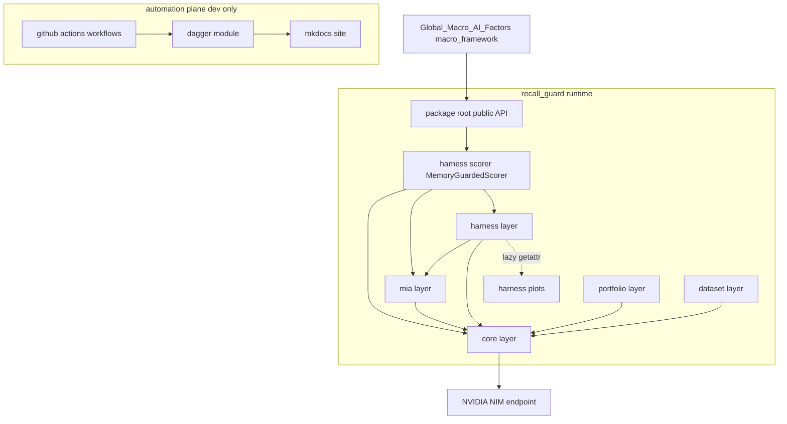
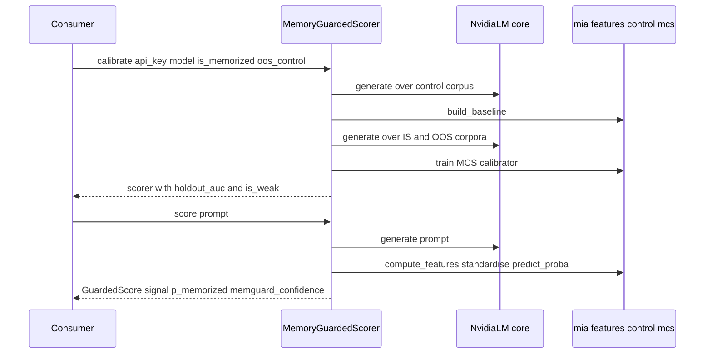
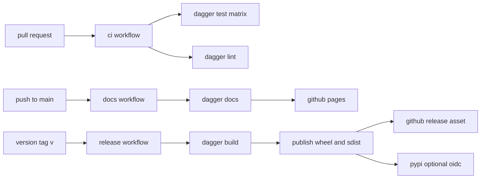
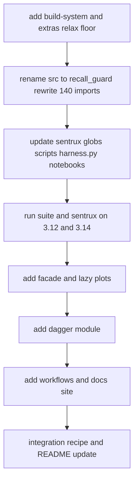

# recall-guard-package — Design

## Overview

**Purpose**: Turn `recall-guard` from two CLIs into an installable Python library
(`recall_guard`) plus its release and documentation machinery, so that
**Global_Macro_AI_Factors** (`macro_framework`) can depend on it and consume **measured
inference-without-recall** — a per-prompt directional signal paired with a calibrated
`p_memorized` contamination score.

**Users**: the downstream factor pipeline (Track A `llm_agent`, `scoring`, `evaluation`)
imports a small façade; the recall_guard maintainer runs one reproducible pipeline for
test/lint/build/docs/publish, triggered by GitHub Actions.

**Impact**: the code moves from a bare `src.*` import tree (no build backend, Python
`>=3.14`) to a distributable `recall_guard` package (Python `>=3.12`, hatchling wheel/sdist,
lean runtime deps with extras), with a stable public API, a Dagger pipeline, three GitHub
Actions workflows, and an autodoc documentation site. Internal statistical behaviour, the
NIM contract, and the existing CLIs are unchanged.

### Goals
- Installable, importable-as-`recall_guard` distribution on Python 3.12 and 3.14 with the
  full suite green.
- A stable façade (`MemoryGuardedScorer`) that returns signal + `p_memorized` + MIA
  features + memguard-discounted confidence, reusing existing primitives (no statistical
  reimplementation; bit-for-bit parity with the harness).
- Lean runtime dependencies; reproducible Dagger pipeline; GitHub-Actions-managed
  CI/release/docs; autodoc API site.

### Non-Goals
- No predictive-alpha objective and no eval-prompt redesign (coin-flip is correct).
- No change to the NIM request/response contract or the existing CLI behaviour.
- No `macro_framework` feature work (the consumer owns its DSPy agent and factor pipeline).
- No new MIA detector beyond MCS; no plugin abstraction for hypothetical future detectors.

## Boundary Commitments

### This Spec Owns
- The distribution: `pyproject.toml` build backend, package layout, Python floor,
  dependency groups/extras, and the `recall_guard` import namespace.
- The public façade `MemoryGuardedScorer` + `GuardedScore` + `ConfigurationError` and the
  curated top-level `recall_guard` public API surface.
- The reproducible pipeline (Dagger module) and the GitHub Actions workflows
  (`ci`, `release`, `docs`).
- The documentation site configuration and its autodoc generation.
- The `src/ → recall_guard/` rename and every import/glob update it forces (sentrux globs,
  tests, scripts, root `harness.py`, notebook builders + committed notebooks).

### Out of Boundary
- The statistical method itself (MIA features, MCS calibration, MemGuard formula, parser,
  bootstrap) — reused unchanged; only relocated by the rename.
- The bundled ETF eval sets / calibration-corpus builder behaviour.
- NIM key provisioning/rotation and the consumer's prompt construction, DSPy agent, factor
  scoring, and data sources.
- Publishing to a public PyPI project as a *required* path (designed as opt-in; see
  Decision: distribution channel).

### Allowed Dependencies
- The façade (harness layer) may depend on `core`, `mia`, and `harness.evaluator`.
- The package root re-export may depend on `core`, `mia`, and the façade only — it must not
  trigger import of `matplotlib`/`vectorbt`.
- The Dagger module and GitHub Actions workflows may depend on `uv`, the build backend, the
  test runner, the linter, the sentrux check, and the docs toolchain — all confined to
  dev/pipeline extras, never the runtime install.
- Layer rule unchanged: `core ← {dataset, mia, portfolio} ← harness`; no upward imports; no
  cycles; `dspy` remains banned.

### Revalidation Triggers
- The signature/return shape of `MemoryGuardedScorer` / `GuardedScore` changes → consumer
  re-checks integration.
- The import namespace, minimum Python version, or the default (non-extra) dependency set
  changes → consumers and CI re-resolve.
- The publish target or documentation URL changes → release/docs automation re-checks.
- Any change that re-introduces an eager `matplotlib`/`vectorbt` import into the
  `import recall_guard` path → Req 4 regression.

## Architecture

### Existing Architecture Analysis
- Layered package `src/{core,mia,harness,portfolio,dataset}` enforced by
  `.sentrux/rules.toml` (order `core=2 ← {mia,portfolio,dataset}=1 ← harness=0`, 0 cycles,
  CC ≤ 25, ≤ 120 lines/fn, `dspy` banned). Layer globs are `src/<layer>/*`.
- Public surface already curated via `__all__` in `core/__init__.py`, `mia/__init__.py`,
  `harness/__init__.py`. `dataset/__init__.py` already uses a **PEP 562 `__getattr__` lazy
  shim** — the pattern this design reuses for `harness` plots.
- Verified dependency hotspots: `matplotlib` is imported eagerly by `harness/plots.py` **and
  `portfolio/backtest.py`**, and re-exported eagerly by `harness/__init__.py`; `vectorbt`
  only by `portfolio/backtest.py`; `rich` only by `harness/report.py`. `core` and `mia` are
  free of all three.
- Verified 3.12 safety: no PEP 695 syntax, no 3.13+ stdlib; lowest construct is
  `datetime.UTC` (3.11+). The floor relax needs **no code porting**.

### Architecture Pattern & Boundary Map

Pattern: **layered library + thin façade**, with a separate **pipeline/automation plane**
that never enters the runtime import graph.



**Key decisions** (detail in research.md):
- The façade lives in the `harness` layer (order 0, may depend on everything below) and is
  re-exported from the package root. **Import-path truth**: importing the façade necessarily
  runs `harness/__init__` (Python executes a package `__init__` before any of its
  submodules), which eagerly loads `evaluator`, `ranker`, `report` (→ `rich`), `runner`, and
  `smoke` — none of which import `matplotlib`/`vectorbt`. Those two libraries are reachable
  ONLY through `harness/plots` and `portfolio/backtest`. Therefore `import recall_guard`
  stays `matplotlib`/`vectorbt`-free iff **(a)** `harness/__init__` defers `plots` via the
  PEP 562 `__getattr__` shim, and **(b)** the package root re-exports the façade plus curated
  `core`/`mia` names but **no `plot_*` symbol and nothing from `portfolio`**. `rich` IS on
  the eager path (via `report`) and is consequently a runtime dependency, not an extra.
- The automation plane (Dagger, workflows, docs) is dev-only and is invoked by GitHub
  Actions; it is not importable from the runtime package.

### Technology Stack

| Layer | Choice / Version | Role in Feature | Notes |
|-------|------------------|-----------------|-------|
| Build backend | hatchling (latest) | wheel + sdist from `recall_guard/` | `packages = ["recall_guard"]`; replaces no-build-system state |
| Env / build runner | uv | sync, build, run in pipeline | matches consumer toolchain |
| Runtime (default) | Python ≥3.12; numpy ≥1.26; scikit-learn ≥1.4; requests ≥2.31; pyyaml ≥6; python-dotenv ≥1; rich ≥13 | inference + scoring + terminal report | floor lowered from 3.14 |
| Extra `backtest` | matplotlib ≥3.8; vectorbt ==0.28.* | CMMD backtest + plots | `vectorbt` compatible with consumer `>=0.28.2` |
| Extra `docs` | mkdocs; mkdocs-material; mkdocstrings[python]; mkdocs-gen-files; mkdocs-literate-nav | autodoc site | griffe, numpy docstrings |
| Extra `dev` | pytest ≥8; pytest-mock; pre-commit; ruff; jupyter; ipykernel; nbclient; nbformat | tests, lint, notebooks | removed from runtime |
| Pipeline | Dagger Python SDK | reproducible test/lint/build/docs/publish | runs in containers, local == CI |
| CI/CD | GitHub Actions; `dagger/dagger-for-github`; `pypa/gh-action-pypi-publish` (OIDC); `actions/configure-pages` + `deploy-pages` | triggers + publish + Pages | no stored long-lived tokens |

> Deviations from current stack: add `[build-system]`; lower Python floor; split one flat
> dependency list into runtime + `backtest`/`docs`/`dev` extras; `ruff target-version` →
> `py312`.

## File Structure Plan

### Directory Structure
```
recall_guard/                 # renamed from src/ (layers + imports updated)
├── __init__.py               # NEW role: public API root; re-exports facade + core/mia names
├── core/                     # unchanged modules; internal imports recall_guard.core.*
├── mia/                      # unchanged modules
├── harness/
│   ├── __init__.py           # MODIFIED: lazy-load plots via PEP 562 __getattr__
│   ├── scorer.py             # NEW: MemoryGuardedScorer, GuardedScore, ConfigurationError
│   ├── evaluator.py          # parser/_score_row reused by the facade (unchanged logic)
│   ├── plots.py              # unchanged; only imported on demand
│   └── ...                   # runner, ranker, report, smoke unchanged
├── portfolio/                # unchanged (backtest still imports matplotlib+vectorbt)
└── dataset/                  # unchanged (already lazy __getattr__)
dagger/
├── dagger.json               # NEW: Dagger module manifest (python sdk)
└── src/recall_guard_ci/main.py  # NEW: test/lint/build/docs/publish functions
.github/workflows/
├── ci.yml                    # NEW: on PR/push -> dagger test + lint (3.12, 3.14)
├── release.yml               # NEW: on v* tag -> dagger build -> publish + GitHub Release
└── docs.yml                  # NEW: on main push -> dagger docs -> GitHub Pages
docs/
├── index.md                  # NEW: landing + integration recipe + runnable example
└── gen_ref_pages.py          # NEW: mkdocs-gen-files script (autodoc nav from recall_guard)
mkdocs.yml                    # NEW: mkdocstrings[python] config, numpy docstrings, strict
```

### Modified Files
- `pyproject.toml` — add `[build-system]` (hatchling) + `[tool.hatch.build.targets.wheel]`;
  `requires-python = ">=3.12"`; split deps into runtime + `[project.optional-dependencies]`
  `backtest`/`docs`/`dev`; `[tool.ruff] target-version = "py312"`; retarget per-file ignores
  to `recall_guard/*` paths.
- `.python-version` — `3.14` → `3.12` (primary dev target == consumer); `uv.lock` regenerated.
- `.sentrux/rules.toml` — layer `paths` and boundary globs `src/<layer>/*` → `recall_guard/<layer>/*`;
  legacy `dspy` ban `from = "src/*"` → `recall_guard/*`.
- `harness.py` (root CLI entry) — `from src.harness.runner` → `from recall_guard.harness.runner`.
- `tests/**` — all `from src.*` imports → `recall_guard.*` (part of the 140-import sweep);
  `tests/harness/test_notebook.py` continues to assert the public API + plots re-exports
  (the lazy `__getattr__` keeps `from recall_guard.harness import plot_*` working).
- `scripts/*.py` — `sys.path` splice retained; `import src.*` → `recall_guard.*`; notebook
  builders' embedded `from src.harness import ...` strings → `recall_guard.harness`.
- `notebooks/qualification.ipynb`, `notebooks/visualize_run.ipynb`, `notebooks/flow.ipynb` —
  update embedded `src.*` imports to `recall_guard.*` (regenerate the two that have builders).
- `README.md` — flip the "Use as a package" note from `src.*` editable to the installed
  `recall_guard` API once the rename lands.

> The rename is mechanical; the 241-test suite plus the sentrux check are the safety net.

## System Flows

### Façade calibrate + score (the consumer's path)

The calibrate phase reuses `mia.control.build_baseline` and `mia.mcs.train` verbatim; the
score phase reuses the evaluator's parser + `compute_mia_features` + `standardise` +
`MCSCalibrator.predict_proba` + the MemGuard formula — guaranteeing Req 3.3 parity.

### Automation plane (GitHub Actions calling Dagger)

Gating: any failing Dagger op fails the workflow and blocks publish (Req 7.5). Publish uses
OIDC/ephemeral credentials only (Req 7.4).

## Requirements Traceability

| Requirement | Summary | Components | Interfaces / Flows |
|-------------|---------|------------|--------------------|
| 1.1–1.4 | Installable distro, `import recall_guard`, no `src`, git-installable | Packaging config; rename | `pyproject.toml`, hatchling wheel target |
| 2.1–2.4 | Python floor 3.12; suite green 3.12 & 3.14; older refused | Packaging config; CI matrix | `pyproject` `requires-python`; `ci.yml`; Dagger test |
| 3.1–3.7 | Façade returns signal+features+`p_memorized`+discount; top-level export; parity; weak surfaced; ref optional; arbitrary prompts; missing-key error | `MemoryGuardedScorer`, `GuardedScore`, `ConfigurationError` | Façade calibrate+score flow |
| 4.1–4.4 | Lean runtime; extras; core imports without extras; vectorbt compat | Packaging config; `harness/__init__` lazy plots | `[project.optional-dependencies]`; PEP 562 shim |
| 5.1–5.6 | Layered structure; no cycles; no DSPy; tests/CLIs/NIM preserved | sentrux config; rename; all layers | `.sentrux/rules.toml`; suite |
| 6.1–6.5 | Reproducible pipeline ops; matrix; lint+arch; local==CI; build==published | Dagger module | `dagger/src/recall_guard_ci/main.py` |
| 7.1–7.5 | CI on PR; tag→build→publish; GitHub Release; credential-free; failure blocks publish | GHA workflows | `ci.yml`, `release.yml` |
| 8.1–8.5 | Autodoc site; façade-first; reflects changes; publish on main; strict build | Docs site | `mkdocs.yml`, `gen_ref_pages.py`, `docs.yml` |
| 9.1–9.3 | uv dependency recipe; runnable example; input/responsibility split | Docs content | `docs/index.md` |

## Components and Interfaces

| Component | Layer | Intent | Req Coverage | Key Dependencies (P0/P1) | Contracts |
|-----------|-------|--------|--------------|--------------------------|-----------|
| MemoryGuardedScorer | harness | Calibrate + score one prompt to a guarded result | 3.1–3.7 | NvidiaLM (P0), build_baseline/train (P0), evaluator parser (P0) | Service, State |
| recall_guard root API | package root | Curated public re-export; lean entry point | 3.2, 4.1, 4.3 | harness.scorer (P0), core/mia names (P1) | State |
| Packaging config | build | Distribution, floor, extras | 1.1–1.4, 2.1–2.4, 4.1–4.4 | hatchling (P0), uv (P1) | Batch |
| harness `__init__` lazy plots | harness | Keep `import recall_guard` lean | 4.1, 4.3 | PEP 562 (P0) | State |
| Dagger pipeline module | automation | Reproducible test/lint/build/docs/publish | 6.1–6.5 | Dagger SDK (P0), uv (P0) | Batch |
| GitHub Actions workflows | automation | Trigger CI/release/docs | 7.1–7.5 | Dagger (P0), pypa publish OIDC (P0), deploy-pages (P1) | Batch |
| Docs site | automation | Autodoc façade reference + recipe | 8.1–8.5, 9.1–9.3 | mkdocstrings (P0) | Batch |

### harness — MemoryGuardedScorer (façade)

| Field | Detail |
|-------|--------|
| Intent | One object that calibrates a per-model MCS and scores prompts into guarded results |
| Requirements | 3.1, 3.2, 3.3, 3.4, 3.5, 3.6, 3.7 |

**Responsibilities & Constraints**
- Owns the public inference-without-recall contract; composes existing primitives only — no
  reimplementation of MIA/MCS/parsing (Req 3.3 parity by construction).
- Construction over HTTP is explicit (`calibrate`); scoring is pure per call afterward.
- Surfaces calibrator quality (`holdout_auc`, `is_weak`) but still scores when weak (3.4).
- Operates on any prompt string; no dependency on the bundled ETF eval set (3.6).

**Dependencies**
- Outbound: `core.nvidia_lm.NvidiaLM` — model calls + logprobs (P0).
- Outbound: `mia.control.build_baseline`, `mia.mcs.train`, `mia.features.compute_mia_features`,
  `mia.control.standardise` — calibration + features (P0).
- Outbound: `harness.evaluator` parser (`_parse_direction`/`_parse_confidence`) + MemGuard
  formula — signal + discount (P0).
- External: NVIDIA NIM endpoint — runtime prerequisite (P0).

**Contracts**: Service [x] / State [x]

##### Service Interface
```python
@dataclass(frozen=True)
class GuardedScore:
    prompt_hash: str
    parse_ok: bool
    signal: int | None                 # parsed direction in {-1, 0, 1}; None on parse failure
    raw_confidence: float | None
    p_memorized: float | None          # in [0, 1]; None when features unavailable
    memguard_confidence: float | None  # raw_confidence * (1 - p_memorized)
    features: MiaFeatures | None
    fail_reason: str | None            # "timeout" | "no_logprobs" | "parse_failure" | "error"

class ConfigurationError(RuntimeError): ...

class MemoryGuardedScorer:
    model: str
    holdout_auc: float
    is_weak: bool

    @classmethod
    def calibrate(
        cls,
        *,
        api_key: str,
        model: str,
        is_memorized: Sequence[str],
        oos_control: Sequence[str],
        reference_model: str | None = None,
        min_auc: float = 0.6,
        min_valid: int = 50,
        seed: int = 0,
        max_workers: int = 8,
        timeout_s: float = 45.0,
        min_call_interval_s: float = 0.0,
    ) -> "MemoryGuardedScorer": ...

    def score(self, prompt: str) -> GuardedScore: ...
    def score_many(self, prompts: Sequence[str], *, max_workers: int = 8) -> list[GuardedScore]: ...
```
- Preconditions: `api_key` non-empty (else `ConfigurationError`); each corpus has ≥2 rows
  that yield usable logprobs (else `ValueError`, mirroring `mcs.train`).
- Postconditions: `score` returns a `GuardedScore`; on a clean parse,
  `memguard_confidence == raw_confidence * (1 - p_memorized)` and `p_memorized ∈ [0, 1]`.
- Invariants: identical `(prompt, calibrated state)` → identical `p_memorized` as the harness
  for the same inputs (Req 3.3); `reference_model=None` omits `ref_delta` without error (3.5).

**Implementation Notes**
- Integration: `calibrate` calls `build_baseline` then `mcs.train`; raises `ValueError` when
  the baseline is uncalibrated (`is_calibrated=False`) so callers never score on an invalid
  calibrator. `score`/`score_many` reuse the evaluator row pipeline.
- Validation: missing/empty `api_key` → `ConfigurationError` at `calibrate`; a NIM
  authentication failure (HTTP 401) surfaces as a clear runtime error rather than a silent
  score (Req 3.7). `min_auc` only sets the `is_weak` flag (it never blocks scoring);
  `min_valid` gates whether the control baseline calibrates at all (uncalibrated →
  `ValueError`). `GuardedScore.fail_reason` reuses the evaluator's exact bucket strings
  (`timeout`, `no_logprobs`, `parse_failure`, `error`) to preserve 3.3 parity.
- Risks: calibration is HTTP-heavy and rate-limit sensitive — `min_call_interval_s` is
  exposed so consumers can pace the free tier.

### package root — recall_guard public API

| Field | Detail |
|-------|--------|
| Intent | The curated public entry point; the only module a consumer imports |
| Requirements | 3.2, 4.1, 4.3 |

**Responsibilities & Constraints**
- Defines the top-level `recall_guard.__all__` and re-exports the façade plus a curated set
  of `core`/`mia` names. It is the seam between "top-level export" (3.2) and "lean import"
  (4.1, 4.3) and is the single highest-risk surface for a Req-4 regression.
- MUST NOT import `harness.plots`, `portfolio.*`, `matplotlib`, or `vectorbt`, and MUST NOT
  include any `plot_*` symbol in `__all__`.

**Dependencies**
- Outbound: `harness.scorer` — façade types (P0); selected `core` + `mia` names (P1).
- Forbidden: `harness.plots`, `portfolio.*`, `matplotlib`, `vectorbt` (P0 prohibition).

**Contracts**: State [x]

**Implementation Notes**
- Integration: the re-export form is `from recall_guard.harness.scorer import
  MemoryGuardedScorer, GuardedScore, ConfigurationError` plus selected
  `from recall_guard.core import ...` / `from recall_guard.mia import ...`. Importing the
  façade still runs `harness/__init__` (matplotlib-free once `plots` is deferred); that is
  acceptable and expected — the guarantee comes from deferring `plots` and the curated
  `__all__`, not from avoiding `harness/__init__`.
- Validation: a `sys.modules` test asserts neither `matplotlib` nor `vectorbt` is imported
  after `import recall_guard`; a second assertion verifies no name in `recall_guard.__all__`
  starts with `plot_`.
- Risks: any future eager re-export of a plotting/portfolio symbol here re-introduces
  matplotlib; the two assertions above guard it.

### build — Packaging config

**Responsibilities & Constraints**: declare the build backend, the `recall_guard` wheel
target, the 3.12 floor, and the runtime/extras split. Owns Req 1, 2, 4 packaging facets.

**Contracts**: Batch [x] — `uv build` / hatchling produces wheel + sdist.

**Implementation Notes**
- Integration: `[tool.hatch.build.targets.wheel] packages = ["recall_guard"]`; no top-level
  `src` package ships (Req 1.3). Git-installable via `uv add git+...@<tag>` (Req 1.4).
- Validation: `requires-python = ">=3.12"` makes an older interpreter fail at install
  resolution (Req 2.4). Default install excludes matplotlib/vectorbt/jupyter/test tooling
  (Req 4.1).
- Risks: 3.12 lock co-resolution of numpy/scikit-learn/vectorbt/numba — verify in CI
  (research follow-up).

### automation — Dagger pipeline module

**Responsibilities & Constraints**: expose `test`, `lint`, `build`, `docs`, `publish` as
container-run functions sharing one base-container builder (uv + project). Owns Req 6.

**Contracts**: Batch [x].

##### Batch / Job Contract
- Trigger: invoked by a maintainer locally (`dagger call <op>`) or by a workflow.
- Input/validation: `test(python_version)` parametrised over the matrix; `lint` runs ruff +
  the sentrux structural check; `build` runs `uv build`; `docs` runs the strict mkdocs build;
  `publish` consumes the `build` artifacts.
- Output/destination: `build`/`docs` emit artifact directories; `publish` emits the wheel +
  sdist to the workflow for upload.
- Idempotency & recovery: pure functions of the repo state + inputs; `build` is the single
  source of the published artifacts (Req 6.5), so re-runs reproduce them.

**Implementation Notes**
- Integration: `dagger/src/recall_guard_ci/main.py`; pinned base image carrying manylinux
  wheels for vectorbt/numba in the `backtest`/test paths.
- Validation: `test` must run the matrix (Req 6.2) and `lint` the arch check (Req 6.3);
  local and CI invocations share the module (Req 6.4).

### automation — GitHub Actions workflows

**Responsibilities & Constraints**: trigger and manage CI/release/docs by calling Dagger;
own no pipeline logic of their own (thin shims). Owns Req 7 (+ 8.4 deploy).

**Contracts**: Batch [x].

**Implementation Notes**
- `ci.yml`: on PR/push → `dagger call test` (3.12, 3.14) + `dagger call lint`; reports
  pass/fail (7.1).
- `release.yml`: on `v*` tag → `dagger call build` → upload to GitHub Release (7.3) and,
  when enabled, publish to PyPI via `pypa/gh-action-pypi-publish` with `id-token: write`
  (7.2, 7.4). Any failed op aborts before publish (7.5).
- `docs.yml`: on main push → `dagger call docs` → `actions/deploy-pages` (8.4).

### automation — Docs site

**Responsibilities & Constraints**: generate the API reference from `recall_guard` public
docstrings + type hints; present the façade first; fail the build on unresolved references.
Owns Req 8, 9.

**Contracts**: Batch [x].

**Implementation Notes**
- Integration: `mkdocs.yml` with `mkdocstrings[python]` (griffe, `docstring_style: numpy`);
  `gen_ref_pages.py` (mkdocs-gen-files) walks the public package and emits one reference
  page per public module driven by `__all__` (8.1, 8.2, 8.3).
- Validation: `mkdocs build --strict` fails on a broken/unresolved reference (8.5).
- Content: `docs/index.md` carries the uv git-dependency recipe (9.1), a runnable
  scorer example (9.2), and the input/responsibility split (9.3).

## Data Models

- **GuardedScore** (new, frozen dataclass) — the façade's return value; a projection of the
  existing `harness.evaluator.Record` renamed for a clean public contract (`signal` =
  `predicted_direction`, `memguard_confidence` = `penalized_confidence`).
- **MiaFeatures** (reused, unchanged) — embedded in `GuardedScore.features`.
- No persistent storage, schema, or migration data. The only "migration" is the source-tree
  rename (see Migration Strategy).

## Error Handling

### Error Strategy
Fail fast at boundaries; never return a silently invalid score.

### Error Categories and Responses
- **Configuration** — empty `api_key` → `ConfigurationError` at `calibrate`; NIM 401 → clear
  runtime error (Req 3.7). Older Python → install-time resolution failure (Req 2.4).
- **Calibration** — uncalibrated baseline or single-class corpus → `ValueError` from
  `calibrate` (reuses `mcs.train` guard); weak calibration is non-fatal but queryable via
  `is_weak` (Req 3.4).
- **Per-prompt** — timeout / missing logprobs / parse failure → `GuardedScore` with
  `parse_ok=False` and a `fail_reason` (reuses evaluator buckets); never raises mid-batch.
- **Pipeline/Release** — any Dagger op failure fails the workflow and blocks publish
  (Req 7.5).

### Monitoring
Reuse existing module logging; the pipeline surfaces op status through workflow logs.

## Testing Strategy

### Unit Tests
- `MemoryGuardedScorer.score` returns the documented `GuardedScore` shape and
  `memguard_confidence == raw_confidence * (1 - p_memorized)` (3.1).
- **Parity**: façade `p_memorized` equals the harness evaluator's for the same mocked LM
  outputs + calibrator (3.3).
- `reference_model=None` omits `ref_delta`; supplied reference includes it (3.5).
- Empty `api_key` → `ConfigurationError`; mocked 401 → clear error (3.7).
- `import recall_guard` imports neither `matplotlib` nor `vectorbt` (`sys.modules`
  assertion) **and** `recall_guard.__all__` contains no `plot_*` name (4.1, 4.3);
  `from recall_guard.harness import plot_*` still resolves via the lazy shim (loading
  matplotlib only at that point).

### Integration Tests
- Built wheel installs into a fresh venv and `import recall_guard` succeeds with no `src`
  package present (1.1, 1.3).
- Full suite green under Python 3.12 and 3.14 via the Dagger matrix (2.2, 2.3, 6.2).
- sentrux check passes post-rename: layer order, **0 cycles**, no `dspy` (5.1, 5.2).
- The `recall-guard check` (`harness.py`) and the CMMD backtest entry points still import
  and run their argument parsers unchanged after the rename (5.4).
- `mkdocs build --strict` succeeds and emits a façade reference page (8.1, 8.5).

### E2E / Pipeline Tests
- `dagger call test` / `lint` / `build` / `docs` run locally and reproduce CI outcomes
  (6.1, 6.4); `build` artifacts match what `release` would upload (6.5).
- `release.yml` dry-run on a tag builds + creates a release without storing credentials
  (7.2, 7.3, 7.4); an injected op failure blocks publish (7.5).

## Security Considerations
- Publishing uses OIDC trusted publishing (PyPI) and the ephemeral workflow token (GitHub
  Release) — no long-lived secrets in the repo (Req 7.4).
- `NVIDIA_API_KEY` is read from the environment by the consumer; the package never persists
  it and surfaces a clear error when it is missing/invalid (Req 3.7).

## Migration Strategy


Rollback: each phase is a separate commit; the green suite + sentrux check gate progression.
The rename (B) is the only high-fan-out step and is validated entirely by the existing tests.
