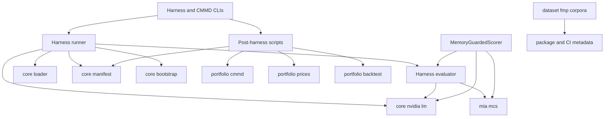
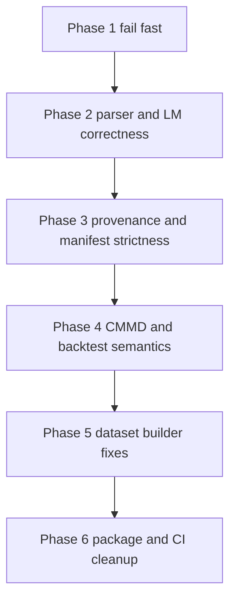

# review-hardening — Design

## Overview
This feature delivers a coordinated hardening pass across the existing `recall_guard` runtime, backtest, dataset, and package/CI surfaces. It does not add a new research capability. It makes the current one safer to operate: invalid runs should fail fast, shared parsing and provider-response rules should behave the same across entry points, manifests should preserve provenance, and portfolio/dataset outputs should stop drifting from the contracts the repo already claims.

The primary users are the maintainer and any operator running the harness or the CMMD orchestrator. The impact is corrective rather than additive: the design routes fixes through the canonical shared modules that already exist, then adds regression tests at those boundaries so the same classes of defect cannot silently return.

### Goals
- Restore fail-fast behavior and typed error handling where false-success runs or raw tracebacks currently occur.
- Converge duplicated parser/input/provenance behavior onto the repo’s canonical shared modules.
- Make CMMD/backtest, dataset, and package/CI outputs consistent with their published contracts and Kiro requirements.

### Non-Goals
- No new MIA feature set, portfolio strategy, or prompt design.
- No new manifest family or second scoring path.
- No downstream feature work in consumer repos.
- No architecture rewrite; this spec hardens current boundaries rather than replacing them.

## Boundary Commitments

### This Spec Owns
- Runtime hardening for `core.nvidia_lm`, `harness.evaluator`, `harness.runner`, and `harness.scorer` where the confirmed defects are rooted.
- Provenance and manifest corrections in `core.loader`, `core.manifest`, and runner-side manifest assembly.
- CMMD/backtest correctness fixes in `portfolio.cmmd`, `portfolio.prices`, `portfolio.backtest`, and `scripts/run_cmmd_backtest.py`.
- Dataset/date/dedup/update fixes in `dataset.fmp_corpora.py` and legacy eval-builder hardening for `scripts/build_etf_multiyear_eval.py`.
- Package/CI contract cleanup in `pyproject.toml` and `ci/src/ci/main.py`.
- Regression coverage for every confirmed fix area.

### Out of Boundary
- New model families, new providers, or new statistical methods.
- Replacing the current harness or backtest architecture with a new subsystem.
- Consumer-side orchestration outside this repository.
- Optional “future-risk” cleanups that were not confirmed as current correctness bugs.

### Allowed Dependencies
- Runtime fixes may depend only on the already-approved package layers: `core <- {dataset, mia, portfolio} <- harness`.
- Scripts may reuse canonical `core`, `harness`, and `portfolio` surfaces but must not add fresh parallel parsers/loaders/manifest formats.
- CI/package fixes may touch dev-only tooling and metadata, but runtime imports must remain lean.

### Revalidation Triggers
- Parser contract changes for `Direction` or `Confidence`.
- Manifest shape or required provenance changes.
- LM error-normalization changes visible to batch or façade callers.
- CMMD/backtest artifact schema or meaning changes.
- Package extra names or CI validation steps changing.

## Architecture

### Existing Architecture Analysis
The repo already has strong canonical boundaries for most of the defect classes:
- `core.loader` owns eval/cutoff parsing and cutoff gating.
- `core.bootstrap` owns confidence-interval behavior.
- `core.manifest` owns manifest serialization/validation.
- `core.nvidia_lm` owns provider I/O and parallel generation.
- `harness.evaluator` owns parser behavior and row/result semantics.
- `harness.scorer` is a thin public façade over existing primitives.
- `portfolio.cmmd`, `portfolio.prices`, and `portfolio.backtest` own post-harness portfolio semantics.

The confirmed bugs largely come from either (a) weakening those boundaries with local duplicate logic, or (b) boundary-local correctness gaps that fan out to many callers. The hardening work therefore follows the shared-boundary pattern rather than a file-by-file patch pattern.

### Architecture Pattern & Boundary Map


**Architecture Integration**:
- Selected pattern: shared-boundary hardening. Fix defects where contracts originate, then keep scripts/callers thin.
- Domain boundaries preserved: loader/bootstrap/manifest/LM/parsing/backtest responsibilities stay where they already live.
- Existing patterns preserved: strict manifest schema, batch/façade parity, lazy runtime boundary, orchestrator built on top of harness outputs.
- New components rationale: none. This design prefers strengthening existing components over adding abstraction.

### Technology Stack

| Layer | Choice / Version | Role in Feature | Notes |
|-------|------------------|-----------------|-------|
| Runtime | Existing Python package | Main repair surface | No new runtime framework |
| ML / Stats | Existing sklearn / numpy stack | MCS/bootstrap fixes | Reuse only |
| Portfolio | Existing pandas / vectorbt stack | Backtest semantics | Remove global-state leak, keep current strategy |
| Data / Fetch | Existing requests + FMP endpoints | Dataset / price fetch fixes | Tighten error typing, date handling |
| CI / Packaging | Existing hatchling, uv, Dagger, GitHub Actions | Package/CI contract cleanup | Dev-only scope |

## File Structure Plan

### Directory Structure
```text
recall_guard/
├── core/
│   ├── loader.py          # Eval/cutoff parsing and cutoff safety
│   ├── bootstrap.py       # Shared CI helper
│   ├── manifest.py        # Manifest schema and strict read/write boundary
│   └── nvidia_lm.py       # LM client, payload validation, pacing, parallel calls
├── harness/
│   ├── evaluator.py       # Canonical parser and batch row/result scoring
│   ├── runner.py          # Harness orchestration, shortlist gating, manifest assembly
│   └── scorer.py          # Public façade over existing primitives
├── mia/
│   └── mcs.py             # Holdout preconditions and ref_delta feature-order contract
├── portfolio/
│   ├── cmmd.py            # CMMD filter semantics
│   ├── prices.py          # FMP price fetch and alignment
│   └── backtest.py        # Weight eligibility, metrics, artifact writer
└── dataset/
    └── fmp_corpora.py     # Corpus ingest, cutoff labeling, dedup, incremental refresh

scripts/
├── run_cmmd_backtest.py   # Post-harness orchestrator and backtest manifest extension
├── analyze_is_oos_gap.py  # IS/OOS gap analysis
└── build_etf_multiyear_eval.py  # Legacy multiyear builder hardening or retirement

ci/src/ci/main.py          # CI lint/build/docs behavior
pyproject.toml             # Extras / dependency-group contract

tests/
├── core/                  # loader/bootstrap/manifest/nvidia_lm regressions
├── harness/               # evaluator/runner/scorer regressions
├── mia/                   # MCS precondition regressions
├── portfolio/             # CMMD/backtest/prices/orchestrator regressions
├── dataset/               # corpus ingest/update regressions
└── scripts/               # eval-builder regressions
```

### Modified Files
- `recall_guard/core/loader.py` — align documented header handling and shared date/input parsing rules.
- `recall_guard/core/bootstrap.py` — make degenerate original-sample handling match the documented drop-on-failure contract.
- `recall_guard/core/manifest.py` — enforce strict type validation for nested manifest fields.
- `recall_guard/core/nvidia_lm.py` — normalize malformed 200 payloads, logprob invariants, and pacing behavior.
- `recall_guard/harness/evaluator.py` — canonical parser fixes and reference-failure degradation semantics.
- `recall_guard/harness/runner.py` — fail-fast orchestration, shortlist validation, bootstrap-arg validation, manifest input hashing.
- `recall_guard/harness/scorer.py` — façade parity with evaluator/runtime failure normalization.
- `recall_guard/mia/mcs.py` — holdout precondition and optional-reference compatibility.
- `recall_guard/portfolio/cmmd.py` — deterministic top-slice semantics and non-finite handling.
- `recall_guard/portfolio/prices.py` — typed fetch failures and payload validation.
- `recall_guard/portfolio/backtest.py` — tradability filtering, equity consistency, atomic writes, vectorbt state isolation.
- `recall_guard/dataset/fmp_corpora.py` — ISO timestamp parsing, strict cutoff labeling, dedup, incremental refresh.
- `scripts/run_cmmd_backtest.py` — weak-calibration abort, metadata coercion reuse, one-sided warning, manifest provenance block.
- `scripts/analyze_is_oos_gap.py` — date normalization consistency.
- `scripts/build_etf_multiyear_eval.py` — explicit date bounds and hard failure on invalid payloads, or deprecation shim.
- `ci/src/ci/main.py` — architecture gate enforcement in lint path.
- `pyproject.toml` — extras contract alignment.
- Matching regression tests under `tests/core`, `tests/harness`, `tests/mia`, `tests/portfolio`, `tests/dataset`, and `tests/scripts`.

## System Flows

### Repair sequencing flow


Key decisions:
- Runtime false-success fixes land before metric/reporting fixes.
- Shared parser and LM-client fixes land before backtest/reporting work that depends on them.
- Provenance fixes land before final output-cleanup work so later artifacts inherit the corrected boundaries.

## Requirements Traceability

| Requirement | Summary | Components | Interfaces | Flows |
|-------------|---------|------------|------------|-------|
| 1.1-1.5 | Fail-fast run integrity | `harness.runner`, `portfolio.prices`, `scripts.run_cmmd_backtest`, `core.bootstrap` | CLI args, shortlist resolution, typed fetch errors | Repair sequencing flow |
| 2.1-2.7 | Shared parsing and provider-response correctness | `core.nvidia_lm`, `harness.evaluator`, `harness.scorer`, `mia.mcs` | parser helpers, façade score path, LM client payload contract | Repair sequencing flow |
| 3.1-3.6 | Reproducible inputs and strict manifest provenance | `core.loader`, `core.manifest`, `harness.runner`, `scripts.run_cmmd_backtest`, `scripts.analyze_is_oos_gap` | manifest schema, input hashing, date normalization | Repair sequencing flow |
| 4.1-4.7 | CMMD and backtest output integrity | `portfolio.cmmd`, `portfolio.backtest`, `scripts.run_cmmd_backtest` | filter API, artifact writer, backtest result semantics | Repair sequencing flow |
| 5.1-5.6 | Dataset and eval-builder trustworthiness | `dataset.fmp_corpora`, `scripts.build_etf_multiyear_eval` | corpus builder/update APIs, legacy eval-builder path | Repair sequencing flow |
| 6.1-6.3 | Package and CI contract enforcement | `ci/src/ci/main.py`, `pyproject.toml` | lint/build/docs and package metadata | Repair sequencing flow |

## Components and Interfaces

### Runtime and provenance core

| Component | Domain/Layer | Intent | Req Coverage | Key Dependencies | Contracts |
|-----------|--------------|--------|--------------|------------------|-----------|
| `core.loader` | Core | Canonical eval/cutoff parsing and cutoff safety | 3 | `runner` (P0) | Service |
| `core.bootstrap` | Core | Shared CI helper with deterministic degenerate behavior | 1, 2, 4 | `evaluator`, `runner` (P0) | Service |
| `core.manifest` | Core | Strict manifest schema and provenance boundary | 3, 4 | `runner`, `run_cmmd_backtest` (P0) | Service, State |
| `core.nvidia_lm` | Core | Canonical provider client and parallel call contract | 1, 2 | `evaluator`, `scorer`, `runner` (P0) | Service |

#### core.loader

| Field | Detail |
|-------|--------|
| Intent | Own the only supported eval/cutoff file parsing and cutoff-safety behavior |
| Requirements | 3.1, 3.2, 3.3 |

**Responsibilities & Constraints**
- Parse `_cutoff_date` exactly according to the documented first-non-empty-line contract.
- Keep warning-vs-error behavior stable for low-N/imbalance while preserving hard cutoff safety.
- Provide a reusable date-normalization contract for post-harness consumers when eval metadata dates must match loader semantics.

**Dependencies**
- Inbound: `harness.runner`, `scripts.run_cmmd_backtest` — input loading and cutoff gating (P0)
- Outbound: stdlib/json/yaml only (P2)

**Contracts**: Service [x] / API [ ] / Event [ ] / Batch [ ] / State [ ]

##### Service Interface
```python
load_eval_set(path: Path | str) -> EvalSet
load_cutoffs(path: Path | str) -> dict[str, date]
assert_cutoff_safe(eval_set: EvalSet, models: list[str], cutoffs: dict[str, date]) -> None
```
- Preconditions: input files exist and are syntactically valid.
- Postconditions: returned eval/cutoff objects reflect the documented parsing contract.
- Invariants: cutoff violations remain fail-fast and typed.

**Implementation Notes**
- Integration: leaf scripts that currently open-code date parsing should consume the loader’s normalization rule instead of drifting.
- Validation: targeted loader tests cover blank-line headers and date-normalization parity.
- Risks: changing warning behavior would ripple into existing tests and should be avoided.

#### core.nvidia_lm

| Field | Detail |
|-------|--------|
| Intent | Normalize provider transport and payload behavior into one typed LM-call contract |
| Requirements | 1.4, 2.4, 2.5, 2.6 |

**Responsibilities & Constraints**
- Convert malformed success payloads into typed runtime failures.
- Enforce token-logprob invariants before downstream MIA feature computation.
- Preserve ordered `generate_many` semantics while making pacing safe under concurrency.

**Dependencies**
- Inbound: `harness.evaluator`, `harness.scorer`, `harness.runner` (P0)
- Outbound: `requests`, stdlib concurrency/time (P1)

**Contracts**: Service [x] / API [ ] / Event [ ] / Batch [ ] / State [ ]

##### Service Interface
```python
class NvidiaLM:
    def generate(prompt: str, temperature: float = 0.0, max_tokens: int = 512) -> CompletionResult

generate_many(lm: NvidiaLM, prompts: Sequence[str], *, max_workers: int = 8) -> list[CompletionResult | Exception]
```
- Preconditions: API key/model are configured.
- Postconditions: success payloads satisfy logprob invariants; malformed payloads surface as typed runtime failures.
- Invariants: ordered parallel results; pacing contract honored when enabled.

**Implementation Notes**
- Integration: evaluator and scorer should not need bespoke malformed-response handling once the client normalizes it.
- Validation: malformed-200 tests and concurrent pacing tests anchor the contract.
- Risks: payload hardening may expose latent provider-shape issues that were previously silent; that is intended.

### Harness scoring path

| Component | Domain/Layer | Intent | Req Coverage | Key Dependencies | Contracts |
|-----------|--------------|--------|--------------|------------------|-----------|
| `harness.evaluator` | Harness | Canonical parser, row-failure semantics, batch result metrics | 1, 2, 4 | `core.nvidia_lm`, `core.bootstrap`, `mia.mcs` (P0) | Service |
| `harness.runner` | Harness | Fail-fast orchestration, shortlist gating, manifest assembly | 1, 3 | `core.loader`, `core.manifest`, `harness.evaluator` (P0) | Service, State |
| `harness.scorer` | Harness | Public façade parity with evaluator | 2 | `core.nvidia_lm`, `harness.evaluator`, `mia.mcs` (P0) | Service |
| `mia.mcs` | MIA | Enforce train/predict contract for holdout and optional reference features | 2 | `sklearn`, `core/bootstrap` consumers (P1) | Service, State |

#### harness.evaluator and harness.scorer

| Field | Detail |
|-------|--------|
| Intent | Keep batch and façade parsing/failure behavior identical |
| Requirements | 2.1, 2.2, 2.3, 2.7 |

**Responsibilities & Constraints**
- One authoritative `Direction` / `Confidence` parser contract.
- One authoritative reference-failure degradation contract.
- One authoritative penalized-confidence formula.

**Dependencies**
- Inbound: `runner`, public callers (P0)
- Outbound: `core.nvidia_lm`, `mia.mcs`, `core.bootstrap` (P0)

**Contracts**: Service [x] / API [ ] / Event [ ] / Batch [ ] / State [ ]

##### Service Interface
```python
evaluate_model(...) -> ModelEvalResult
MemoryGuardedScorer.score(prompt: str) -> GuardedScore
MemoryGuardedScorer.score_many(prompts: Sequence[str], *, max_workers: int = 8) -> list[GuardedScore]
```
- Preconditions: parser and LM client share the same response contract.
- Postconditions: batch and façade produce equivalent acceptance/failure outcomes for the same LM output.
- Invariants: malformed fractional directions are rejected; percent confidence means percent; optional reference failures do not invalidate valid primary outputs.

**Implementation Notes**
- Integration: smoke should reuse evaluator parsing semantics rather than duplicating them.
- Validation: parity tests should cover batch vs façade for parsing and failure cases.
- Risks: changing parser semantics will require coordinated smoke/evaluator/scorer test updates.

#### harness.runner

| Field | Detail |
|-------|--------|
| Intent | Orchestrate loading, shortlist resolution, evaluation, and artifact writing without false-success states |
| Requirements | 1.1, 1.2, 1.5, 3.1, 3.6 |

**Responsibilities & Constraints**
- Reject empty shortlists and invalid bootstrap counts before a success-looking run can emerge.
- Preserve true run failure for unexpected per-model errors.
- Bind manifest provenance to the inputs actually consumed.

**Dependencies**
- Inbound: CLI and scripts (P0)
- Outbound: `core.loader`, `harness.evaluator`, `core.manifest`, `core.bootstrap` (P0)

**Contracts**: Service [x] / API [ ] / Event [ ] / Batch [ ] / State [x]

**Implementation Notes**
- Integration: keep exit-code meanings stable while tightening failure conditions.
- Validation: runner tests must prove no-success-on-empty-shortlist and no late bootstrap-arg failures.
- Risks: changing exit paths affects scripts that currently assume success on empty outputs.

### Portfolio and post-harness flow

| Component | Domain/Layer | Intent | Req Coverage | Key Dependencies | Contracts |
|-----------|--------------|--------|--------------|------------------|-----------|
| `portfolio.cmmd` | Portfolio | Deterministic memorization-slice filtering | 4 | `backtest`, scripts (P0) | Service |
| `portfolio.prices` | Portfolio | Typed price fetch/alignment surface | 1, 4 | `run_cmmd_backtest` (P0) | Service |
| `portfolio.backtest` | Portfolio | Tradeability filter, weights, metrics, artifact persistence | 4 | `portfolio.cmmd`, `portfolio.prices` (P0) | Service, State |
| `scripts.run_cmmd_backtest` | Script | Orchestrate post-harness analytics, backtest, and manifest extension | 1, 3, 4 | harness outputs, portfolio modules, manifest (P0) | Batch, State |
| `scripts.analyze_is_oos_gap` | Script | Gap analysis over eval metadata and records | 3 | prompt-hash/date contract (P1) | Batch |

#### portfolio.backtest

| Field | Detail |
|-------|--------|
| Intent | Make row eligibility, metric outputs, and artifact writing reflect the strategy that actually ran |
| Requirements | 4.2, 4.3, 4.4, 4.5 |

**Responsibilities & Constraints**
- Tradeability filtering must happen before thresholding/counting semantics are finalized.
- Equity, returns, and summary outputs must agree numerically.
- Artifact persistence must preserve pre-write state on failure.
- Vectorbt configuration must stay local to the call.

**Dependencies**
- Inbound: `scripts.run_cmmd_backtest` (P0)
- Outbound: `portfolio.cmmd`, `vectorbt`, `matplotlib` (P1)

**Contracts**: Service [x] / API [ ] / Event [ ] / Batch [ ] / State [x]

##### Service Interface
```python
run_backtest(records, prices, prompt_metadata, *, cmmd_quantile=0.80, fees_one_way=0.00075, init_cash=1.0, seed=0, bootstrap_n=1000) -> BacktestResult
write_backtest_artifacts(result: BacktestResult, run_dir: Path | str) -> dict[str, Path]
```
- Preconditions: `prompt_metadata` and aligned prices correspond to the evaluated prompt hashes.
- Postconditions: reported signal counts and written artifacts match the tradeable rows and fee treatment actually used.
- Invariants: no destructive partial-write rollback; no process-global vectorbt leakage.

**Implementation Notes**
- Integration: `run_cmmd_backtest` should consume backtest warnings and artifact paths, not reinterpret core engine behavior.
- Validation: writer failure tests and metric-consistency tests are mandatory.
- Risks: fixing row eligibility may change historical backtest totals; that is acceptable because the current totals are incorrect.

#### scripts.run_cmmd_backtest

| Field | Detail |
|-------|--------|
| Intent | Keep the harness-driven backtest pipeline aligned with calibration, metadata, and provenance contracts |
| Requirements | 1.3, 3.3, 3.5, 4.6 |

**Responsibilities & Constraints**
- Abort on all documented calibration-failure states.
- Reuse canonical eval metadata coercion and date normalization.
- Warn when CMMD has no meaningful cross-regime rows to remove.
- Persist backtest provenance in the manifest extension.

**Dependencies**
- Inbound: CLI/operator flow (P0)
- Outbound: `harness.runner`, `portfolio.backtest`, `portfolio.prices`, `core.manifest` (P0)

**Contracts**: Service [ ] / API [ ] / Event [ ] / Batch [x] / State [x]

**Implementation Notes**
- Integration: this script should stay thin; canonical parsing/provenance belongs in shared modules.
- Validation: smoke tests must exercise weak-calibration abort, one-sided warning, and metadata coercion reuse.
- Risks: changing manifest extension shape requires matching manifest tests and consumers.

### Dataset and package/CI cleanup

| Component | Domain/Layer | Intent | Req Coverage | Key Dependencies | Contracts |
|-----------|--------------|--------|--------------|------------------|-----------|
| `dataset.fmp_corpora` | Dataset | Accept valid timestamps, enforce strict cutoff labels, preserve valid incremental ingest | 5 | FMP data and dataset tests (P0) | Service, Batch |
| `scripts.build_etf_multiyear_eval` | Script | Stop silently emitting truncated/empty eval files | 5 | FMP fetch behavior (P1) | Batch |
| `ci/src/ci/main.py` | CI | Enforce actual architecture gate in lint path | 6 | GitHub Actions, sentrux (P1) | Batch |
| `pyproject.toml` | Packaging | Align extras metadata with promised install contract | 6 | build backend metadata (P1) | State |

#### dataset.fmp_corpora

| Field | Detail |
|-------|--------|
| Intent | Keep corpus build/update behavior faithful to timestamp, cutoff, dedup, and incremental-ingest rules |
| Requirements | 5.1, 5.2, 5.3, 5.4 |

**Responsibilities & Constraints**
- Parse valid ISO timestamps.
- Treat cutoff-day rows according to the approved strict boundary.
- Dedup untitled-body articles without collapsing unrelated records.
- Keep incremental OOS refresh open to same-day late arrivals.

**Dependencies**
- Inbound: maintainers, tests (P0)
- Outbound: FMP payload shapes and local files (P1)

**Contracts**: Service [x] / API [ ] / Event [ ] / Batch [x] / State [x]

**Implementation Notes**
- Integration: fixes should stay inside shared corpus helpers rather than adding alternate ingest paths.
- Validation: dataset tests should anchor each boundary rule explicitly.
- Risks: boundary-date changes may alter generated corpora counts; document via test updates.

## Data Models

### Domain Model
- Harness/runtime domain entities already exist (`EvalSet`, `Record`, `ModelEvalResult`, `Manifest`, `CompletionResult`, `BacktestResult`).
- This spec does not add new top-level domain objects. It tightens validation and invariants on the existing ones.

### Logical Data Model
- `Manifest` remains the single persisted run-provenance object.
- `manifest.backtest` remains an optional extension field, but its contents must be sufficient to audit IS/OOS backtest provenance.
- `Record` remains the single row-level scoring record; backtest and gap-analysis joins continue to derive ticker/date from eval-row metadata keyed by prompt hash.

### Data Contracts & Integration
- LM success payload contract must include valid `choices[0]`, valid `message.content`, and token-logprob structures with realized logprob and non-empty alternatives.
- Eval metadata contract remains `metadata.ticker` + `metadata.date`; post-harness consumers must apply one normalized interpretation of the date field.
- Price-fetch contract remains an aligned `date x ticker` price matrix with typed fetch failures.

## Error Handling

### Error Strategy
- Fail fast for invalid CLI/bootstrap inputs, empty shortlist, malformed provider payloads, and true orchestration failures.
- Degrade gracefully only where the existing contracts explicitly allow it, such as optional-reference behavior and dropped failing bootstrap resamples.
- Reject malformed persisted state rather than silently coercing it.

### Error Categories and Responses
- **User / operator errors**: invalid CLI args, missing API keys, unsupported eval metadata — fail early with typed, actionable errors.
- **Provider/runtime errors**: malformed 200 payloads, transport failures, unavailable prices — normalize to typed runtime failures or typed orchestrator failures.
- **Research/data integrity errors**: one-sided CMMD runs, inconsistent provenance, malformed manifest contents — warn or fail according to the tightened contracts above.

### Monitoring
- Existing stderr/reporting paths remain the user-visible surfaces.
- New regression coverage is the primary observability hook for this hardening work.

## Testing Strategy

### Unit Tests
- `core.loader`: blank-line `_cutoff_date`, shared date normalization, strict cutoff behavior.
- `core.bootstrap`: flat original-sample handling.
- `core.manifest`: reject malformed nested fields.
- `core.nvidia_lm`: malformed 200 payloads, missing logprob invariants, pacing behavior.
- `portfolio.cmmd`: tie-heavy thresholding and non-finite score handling.
- `dataset.fmp_corpora`: ISO timestamps, strict cutoff-day behavior, untitled dedup, same-day late-arrival refresh.

### Integration Tests
- `harness.runner`: empty-shortlist fail, invalid bootstrap arg rejection, preserved true failure path, stable manifest hashing of consumed inputs.
- `harness.evaluator` / `harness.scorer`: parser parity, percent parsing, reference-failure degradation.
- `portfolio.backtest`: tradeability filtering before thresholds/counts, consistent equity/return outputs, vectorbt state isolation.
- `scripts.run_cmmd_backtest`: weak-calibration abort, metadata coercion reuse, one-sided warning, manifest provenance block.

### E2E / Workflow Tests
- Orchestrated CMMD smoke run with valid inputs still writes the expected artifacts and manifest extension.
- Harness smoke run with all candidates failing exits nonzero and avoids success-looking output.
- Package/CI checks prove the structural architecture gate actually runs and extras metadata matches the declared contract.

## Security Considerations
- No new auth system is introduced.
- The security-relevant runtime change is error normalization: malformed provider responses and missing credentials must no longer escape as unrelated exceptions or silently degrade in unsafe ways.

## Performance & Scalability
- No new scaling architecture is introduced.
- The only performance-sensitive runtime change is pacing safety under concurrency; correctness takes priority over raw throughput where the two conflict.

## Migration Strategy
- Apply changes phase-by-phase in the order shown above.
- Each phase lands with targeted regression tests before the next phase begins.
- Packaging/CI cleanup is last so runtime correctness work is not blocked on metadata churn.
