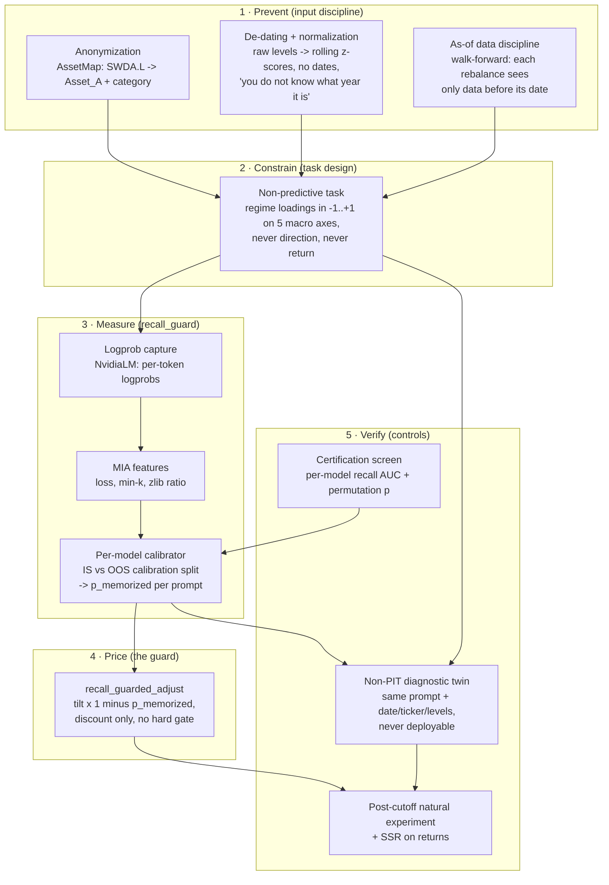

# How this system achieves point-in-time (PIT) inference

Reference description for the thesis illustration. Each component maps to code or to a named external consumer component. The measurement layer and the `recall_guard` package live in this repository; the input discipline, task design, and portfolio layers referenced here live in the consumer pipeline at [Global_Macro_AI_Factors](https://github.com/norandom/Global_Macro_AI_Factors).

## The problem with just prompting

A naive prompt ("It is March 2022. CPI is 8.5%, the 10y-2y spread is -0.2. What happens to SPY?") gives the model three strong cues: the date, the real ticker, and raw levels that can fingerprint a period. A model trained through 2024 may answer partly from stored text. From the prompt alone, it is hard to separate recall from reasoning. That is the point-in-time problem this stack is trying to reduce and measure.

## The PIT stack: five layers

The architecture uses the usual point-in-time controls first, then adds a measurement layer for what still leaks through.

### Layer 1: prevent (input discipline)

- **Anonymization** (`macro_framework/anonymize.py`, `AssetMap`): real tickers do not reach the prompt. Assets appear as `Asset_A..Asset_D` plus a category word.
- **De-dating and normalization** (`render_regime_loadings_prompt` in `macro_framework/factor_scoring.py`): the macro state is z-scored against a rolling window, raw levels are withheld, and no calendar token appears.
- **As-of discipline** (`mf.build_walk_forward_targets`): every rebalance date is computed from data strictly before it, including the z-score windows.

### Layer 2: constrain (task design)

The model characterizes the regime as continuous loadings on five named macro axes. It is not asked for a return forecast. Exposures come from a fixed axis-to-asset table (`loadings_to_tilt_views`), and the Black-Litterman conversion is reused unchanged.

### Layer 3: measure (`recall_guard`)

Prevention is never total, so the repository measures a residual score per prompt rather than assuming the prompt is clean. The scoring model's per-token logprobs (`NvidiaLM`) feed membership-inference features (`loss`, `min_k`, `min_k_pp`, `zlib_ratio`, and optional `ref_delta`), and a per-model classifier trained on the repository's in-sample vs out-of-sample calibration split maps them to `p_memorized` in `[0, 1]`.

Within this repository, that score is a model-specific contamination signal. It is not direct proof that a prompt was memorized.

### Layer 4: price (the guard)

`recall_guarded_adjust` scales each exposure tilt by `(1 - p_memorized)`. It is a discount, not a hard gate. Higher-score prompts still contribute, but with less weight.

### Layer 5: verify (controls)

The control layer shown here mostly belongs to the external consumer pipeline, not to this repository:

- **The non-PIT twin** runs the same broader strategy with identifying prompt content restored (date, tickers, raw levels).
- **Certification screen** checks candidate models on a controlled recall boundary before deployment.
- **Post-cutoff experiments and return diagnostics** test whether any measured premium persists when the prompt dates move beyond the model's published training cutoff.

Those controls are useful context for the thesis diagram, but the numerical results for them are not generated inside this repository.

## What "just prompting" lacks, in one table

| Concern | Just prompting | This architecture |
|---|---|---|
| Identity leakage | tickers in prompt | anonymized asset letters |
| Date leakage | dates/years in prompt | de-dated, z-scored state |
| Level fingerprints | raw macro levels | rolling z-scores only |
| Data lookahead | whatever the context holds | as-of walk-forward slices |
| Forecast channel | model asked to predict | loadings only, no return ask |
| Contamination status | implicit | measured per prompt with `p_memorized` |
| Residual memory handling | unpriced | discounted by `1 - p_memorized` |
| Validation | none | external twin/control workflow + local scoring artifacts |

One-sentence caption version: *point-in-time inference here is a stack: anonymize, de-date, restrict the data, remove the direct forecast ask, then attach a per-prompt contamination score to what remains.*
